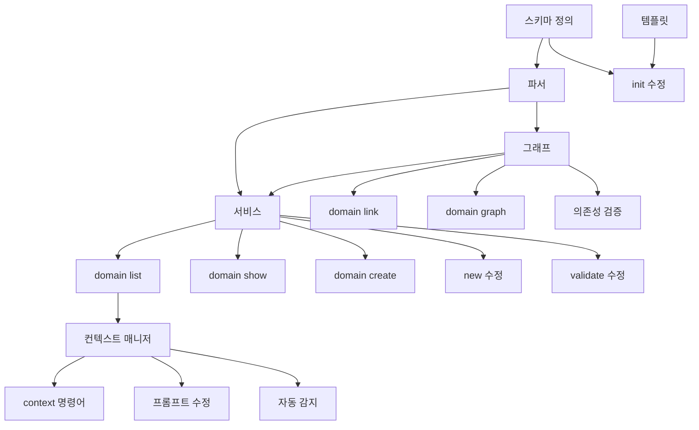

# Phase 1: 스펙 스코프 분리 - 구현 태스크

> **목표**: 도메인 기반 스펙 관리로 컨텍스트 제어
> **상태**: 🚧 진행 중
> **버전**: v2.0.0

---

## 진행 상태

```
전체 진행률: 0/35 (0%)

1.0 공통 기반:        [ ] 0/8
1.1 도메인 CLI:       [ ] 0/6
1.2 컨텍스트 제한:    [ ] 0/5
1.3 스펙 생성 확장:   [ ] 0/4
1.4 검증 확장:        [ ] 0/4
1.5 슬래시 커맨드:    [ ] 0/4
1.6 문서화:           [ ] 0/4
```

---

## 1.0 공통 기반 (8 tasks)

### TASK-1.0.1: domains.yml 스키마 정의
- **상태**: [ ] 대기
- **설명**: 도메인 정의 파일의 Zod 스키마 작성
- **산출물**: `src/schemas/domain.ts`
- **내용**:
  ```yaml
  domains:
    core:
      name: "핵심 기능"
      description: "데이터 모델, 공통 유틸리티"
      owners: ["@core-team"]
    auth:
      name: "인증/인가"
      dependencies: [core]
  rules:
    - from: order
      to: auth
      allowed: true
  ```

### TASK-1.0.2: domain.md 템플릿 생성
- **상태**: [ ] 대기
- **설명**: 도메인 개요 문서 템플릿
- **산출물**: `templates/domain.md`
- **내용**:
  ```markdown
  # {Domain} 도메인
  ## 개요
  ## 범위
  ## 의존성
  ## 공개 인터페이스
  ```

### TASK-1.0.3: 도메인 파서 구현
- **상태**: [ ] 대기
- **설명**: domains.yml 파싱 및 검증
- **산출물**: `src/core/domain/parser.ts`
- **의존성**: TASK-1.0.1

### TASK-1.0.4: 도메인 그래프 구현
- **상태**: [ ] 대기
- **설명**: 도메인 간 의존성 그래프 관리
- **산출물**: `src/core/domain/graph.ts`
- **기능**:
  - 순환 의존성 감지
  - 의존성 정렬 (topological sort)
  - 그래프 시각화 (Mermaid)

### TASK-1.0.5: 도메인 서비스 구현
- **상태**: [ ] 대기
- **설명**: 도메인 CRUD 비즈니스 로직
- **산출물**: `src/core/domain/service.ts`
- **의존성**: TASK-1.0.3, TASK-1.0.4

### TASK-1.0.6: 디렉토리 구조 마이그레이션
- **상태**: [ ] 대기
- **설명**: 기존 flat 구조 → 도메인 기반 구조 변환
- **산출물**: `src/core/domain/migrator.ts`
- **기능**:
  - `sdd migrate to-domains` 명령어 지원
  - 기존 스펙을 도메인 폴더로 이동

### TASK-1.0.7: init 명령어 도메인 지원
- **상태**: [ ] 대기
- **설명**: `sdd init`에서 domains.yml 생성
- **산출물**: `src/cli/commands/init.ts` 수정
- **의존성**: TASK-1.0.1, TASK-1.0.2

### TASK-1.0.8: 테스트 작성 (공통)
- **상태**: [ ] 대기
- **설명**: 도메인 스키마, 파서, 그래프 테스트
- **산출물**: `tests/unit/core/domain/*.test.ts`
- **의존성**: TASK-1.0.1 ~ 1.0.6

---

## 1.1 도메인 CLI (6 tasks)

### TASK-1.1.1: `sdd domain list` 명령어
- **상태**: [ ] 대기
- **설명**: 도메인 목록 조회
- **산출물**: `src/cli/commands/domain.ts`
- **출력**:
  ```
  📁 도메인 목록 (3개)
  ├── core     핵심 기능 (5 specs)
  ├── auth     인증/인가 (3 specs) → [core]
  └── order    주문/결제 (4 specs) → [core, auth]
  ```

### TASK-1.1.2: `sdd domain show <name>` 명령어
- **상태**: [ ] 대기
- **설명**: 도메인 상세 정보 조회
- **산출물**: `src/cli/commands/domain.ts`
- **출력**:
  ```
  # auth 도메인
  설명: 인증/인가
  담당: @security-team
  의존성: core
  스펙 목록:
    - user-login (approved)
    - oauth-google (draft)
    - session-management (review)
  ```

### TASK-1.1.3: `sdd domain create <name>` 명령어
- **상태**: [ ] 대기
- **설명**: 새 도메인 생성
- **산출물**: `src/cli/commands/domain.ts`
- **기능**:
  - domains.yml에 도메인 추가
  - `.sdd/specs/<domain>/domain.md` 생성

### TASK-1.1.4: `sdd domain link` 명령어
- **상태**: [ ] 대기
- **설명**: 도메인 간 의존성 설정
- **산출물**: `src/cli/commands/domain.ts`
- **사용법**:
  ```bash
  sdd domain link order --depends-on auth
  sdd domain link order --depends-on core
  ```

### TASK-1.1.5: `sdd domain graph` 명령어
- **상태**: [ ] 대기
- **설명**: 도메인 의존성 그래프 시각화
- **산출물**: `src/cli/commands/domain.ts`
- **옵션**:
  - `--format mermaid` (기본)
  - `--format json`

### TASK-1.1.6: 테스트 작성 (CLI)
- **상태**: [ ] 대기
- **설명**: 도메인 CLI 명령어 테스트
- **산출물**: `tests/unit/cli/commands/domain.test.ts`
- **의존성**: TASK-1.1.1 ~ 1.1.5

---

## 1.2 컨텍스트 제한 (5 tasks)

### TASK-1.2.1: 컨텍스트 매니저 구현
- **상태**: [ ] 대기
- **설명**: 현재 작업 도메인 컨텍스트 관리
- **산출물**: `src/core/context/manager.ts`
- **기능**:
  - 활성 도메인 설정/조회
  - 도메인 범위 스펙 필터링
  - 의존성 도메인 자동 포함 (읽기 전용)

### TASK-1.2.2: `sdd context` 명령어
- **상태**: [ ] 대기
- **설명**: 작업 컨텍스트 관리
- **산출물**: `src/cli/commands/context.ts`
- **사용법**:
  ```bash
  sdd context auth           # auth 도메인만 활성화
  sdd context auth order     # 복수 도메인 활성화
  sdd context --current      # 현재 컨텍스트 확인
  sdd context --clear        # 컨텍스트 초기화 (전체)
  ```

### TASK-1.2.3: 프롬프트 생성기 수정
- **상태**: [ ] 대기
- **설명**: Claude 프롬프트에 컨텍스트 정보 포함
- **산출물**: `src/generators/claude-commands.ts` 수정
- **출력 예시**:
  ```markdown
  현재 컨텍스트: auth 도메인
  - 도메인 개요: auth/domain.md
  - 작업 대상: auth/user-login/spec.md
  - 의존성: core 도메인 (읽기 전용)

  다른 도메인은 무시하세요.
  ```

### TASK-1.2.4: 상태 저장 (.sdd/context.json)
- **상태**: [ ] 대기
- **설명**: 현재 컨텍스트 상태 영속화
- **산출물**: `src/core/context/storage.ts`
- **내용**:
  ```json
  {
    "active_domains": ["auth"],
    "read_only_domains": ["core"],
    "updated_at": "2025-12-29T10:00:00Z"
  }
  ```

### TASK-1.2.5: 테스트 작성 (컨텍스트)
- **상태**: [ ] 대기
- **설명**: 컨텍스트 매니저 테스트
- **산출물**: `tests/unit/core/context/*.test.ts`
- **의존성**: TASK-1.2.1 ~ 1.2.4

---

## 1.3 스펙 생성 확장 (4 tasks)

### TASK-1.3.1: `sdd new <domain>/<feature>` 형식 지원
- **상태**: [ ] 대기
- **설명**: 도메인 기반 스펙 생성
- **산출물**: `src/cli/commands/new.ts` 수정
- **예시**:
  ```bash
  sdd new auth/mfa-setup        # .sdd/specs/auth/mfa-setup/
  sdd new order/refund          # .sdd/specs/order/refund/
  ```

### TASK-1.3.2: 도메인 자동 감지
- **상태**: [ ] 대기
- **설명**: 현재 컨텍스트에서 도메인 자동 추론
- **산출물**: `src/cli/commands/new.ts` 수정
- **기능**:
  - 컨텍스트가 단일 도메인이면 자동 사용
  - 복수 도메인이면 선택 프롬프트

### TASK-1.3.3: 스펙 템플릿 도메인 메타데이터
- **상태**: [ ] 대기
- **설명**: spec.md에 domain 필드 추가
- **산출물**: `templates/spec.md` 수정
- **frontmatter**:
  ```yaml
  ---
  id: auth/mfa-setup
  domain: auth
  title: "MFA 설정"
  status: draft
  ---
  ```

### TASK-1.3.4: 테스트 작성 (스펙 생성)
- **상태**: [ ] 대기
- **설명**: 도메인 기반 스펙 생성 테스트
- **산출물**: `tests/unit/cli/commands/new.test.ts` 확장
- **의존성**: TASK-1.3.1 ~ 1.3.3

---

## 1.4 검증 확장 (4 tasks)

### TASK-1.4.1: `sdd validate --domain <name>` 옵션
- **상태**: [ ] 대기
- **설명**: 특정 도메인만 검증
- **산출물**: `src/cli/commands/validate.ts` 수정
- **예시**:
  ```bash
  sdd validate --domain auth    # auth 도메인만 검증
  sdd validate --domain auth,order  # 복수 도메인
  ```

### TASK-1.4.2: 도메인 의존성 규칙 검증
- **상태**: [ ] 대기
- **설명**: domains.yml rules 기반 위반 검사
- **산출물**: `src/core/domain/validator.ts`
- **검증 항목**:
  - 순환 의존성
  - 금지된 의존성 (allowed: false)
  - 미선언 의존성 사용

### TASK-1.4.3: `sdd status --domain <name>` 옵션
- **상태**: [ ] 대기
- **설명**: 특정 도메인 상태만 조회
- **산출물**: `src/cli/commands/status.ts` 수정

### TASK-1.4.4: 테스트 작성 (검증)
- **상태**: [ ] 대기
- **설명**: 도메인 검증 테스트
- **산출물**: `tests/unit/core/domain/validator.test.ts`
- **의존성**: TASK-1.4.1 ~ 1.4.3

---

## 1.5 슬래시 커맨드 (4 tasks)

### TASK-1.5.1: `/sdd.domain` 슬래시 커맨드
- **상태**: [ ] 대기
- **설명**: 도메인 관리 슬래시 커맨드
- **산출물**: `templates/commands/sdd.domain.md`
- **기능**:
  - 도메인 목록/상세 조회
  - 도메인 생성 가이드
  - 의존성 설정 가이드

### TASK-1.5.2: `/sdd.context` 슬래시 커맨드
- **상태**: [ ] 대기
- **설명**: 컨텍스트 관리 슬래시 커맨드
- **산출물**: `templates/commands/sdd.context.md`
- **기능**:
  - 컨텍스트 활성화/비활성화
  - 현재 컨텍스트 표시

### TASK-1.5.3: 기존 커맨드 업데이트
- **상태**: [ ] 대기
- **설명**: 도메인 컨텍스트 인식하도록 수정
- **산출물**:
  - `templates/commands/sdd.new.md`
  - `templates/commands/sdd.start.md`
  - `templates/commands/sdd.implement.md`

### TASK-1.5.4: claude-commands.ts 업데이트
- **상태**: [ ] 대기
- **설명**: 도메인 슬래시 커맨드 생성 로직
- **산출물**: `src/generators/claude-commands.ts` 수정
- **의존성**: TASK-1.5.1 ~ 1.5.3

---

## 1.6 문서화 (4 tasks)

### TASK-1.6.1: 도메인 시스템 가이드
- **상태**: [ ] 대기
- **설명**: 도메인 기반 스펙 관리 가이드
- **산출물**: `docs/guide/domain-system.md`

### TASK-1.6.2: CLI 레퍼런스 업데이트
- **상태**: [ ] 대기
- **설명**: 도메인 관련 CLI 문서
- **산출물**:
  - `docs/cli/domain.md`
  - `docs/cli/context.md`

### TASK-1.6.3: README 업데이트
- **상태**: [ ] 대기
- **설명**: 도메인 시스템 섹션 추가
- **산출물**: `README.md` 수정

### TASK-1.6.4: VitePress 사이드바 업데이트
- **상태**: [ ] 대기
- **설명**: 도메인 관련 문서 네비게이션
- **산출물**: `docs/.vitepress/config.ts` 수정

---

## 구현 순서 (권장)

```
1. 공통 기반 (1.0)
   └── 도메인 스키마/파서/그래프
       │
       ▼
2. 도메인 CLI (1.1)
   └── list/show/create/link
       │
       ▼
3. 스펙 생성 (1.3)
   └── domain/<feature> 형식
       │
       ▼
4. 컨텍스트 (1.2)
   └── context 관리
       │
       ▼
5. 검증 (1.4)
   └── --domain 옵션
       │
       ▼
6. 슬래시 커맨드 (1.5)
   └── /sdd.domain, /sdd.context
       │
       ▼
7. 문서화 (1.6)
   └── 가이드, CLI 레퍼런스
```

---

## 의존성 그래프



---

## 산출물 체크리스트

### 새 파일
- [ ] `src/schemas/domain.ts`
- [ ] `src/core/domain/parser.ts`
- [ ] `src/core/domain/graph.ts`
- [ ] `src/core/domain/service.ts`
- [ ] `src/core/domain/migrator.ts`
- [ ] `src/core/domain/validator.ts`
- [ ] `src/core/context/manager.ts`
- [ ] `src/core/context/storage.ts`
- [ ] `src/cli/commands/domain.ts`
- [ ] `src/cli/commands/context.ts`
- [ ] `templates/domain.md`
- [ ] `templates/commands/sdd.domain.md`
- [ ] `templates/commands/sdd.context.md`
- [ ] `docs/guide/domain-system.md`
- [ ] `docs/cli/domain.md`
- [ ] `docs/cli/context.md`

### 수정 파일
- [ ] `src/cli/commands/init.ts`
- [ ] `src/cli/commands/new.ts`
- [ ] `src/cli/commands/validate.ts`
- [ ] `src/cli/commands/status.ts`
- [ ] `src/generators/claude-commands.ts`
- [ ] `templates/spec.md`
- [ ] `README.md`
- [ ] `docs/.vitepress/config.ts`

### 테스트 파일
- [ ] `tests/unit/core/domain/parser.test.ts`
- [ ] `tests/unit/core/domain/graph.test.ts`
- [ ] `tests/unit/core/domain/service.test.ts`
- [ ] `tests/unit/core/domain/validator.test.ts`
- [ ] `tests/unit/core/context/manager.test.ts`
- [ ] `tests/unit/cli/commands/domain.test.ts`
- [ ] `tests/unit/cli/commands/context.test.ts`

---

## 예상 일정

| 섹션 | 태스크 수 | 예상 소요 |
|------|----------|----------|
| 1.0 공통 기반 | 8 | 2-3일 |
| 1.1 도메인 CLI | 6 | 1-2일 |
| 1.2 컨텍스트 | 5 | 1-2일 |
| 1.3 스펙 생성 | 4 | 1일 |
| 1.4 검증 확장 | 4 | 1일 |
| 1.5 슬래시 커맨드 | 4 | 1일 |
| 1.6 문서화 | 4 | 1일 |
| **합계** | **35** | **8-11일** |

---

## 완료 조건

Phase 1-G 완료 체크리스트:
- [ ] `sdd domain create/list/show/link/graph` 동작
- [ ] `sdd context` 동작
- [ ] `sdd new <domain>/<feature>` 동작
- [ ] `sdd validate --domain` 동작
- [ ] `/sdd.domain`, `/sdd.context` 슬래시 커맨드 동작
- [ ] 테스트 커버리지 유지 (65%+)
- [ ] 문서화 완료
- [ ] README 업데이트
- [ ] CHANGELOG 업데이트
