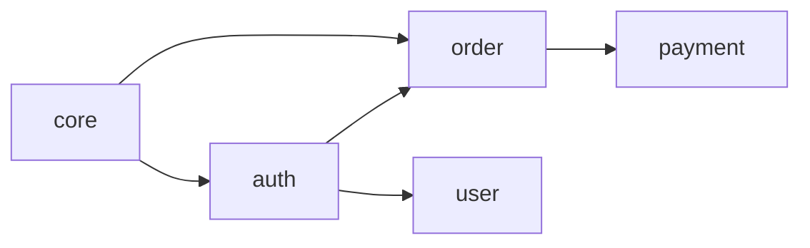

# sdd domain

Manages domains and visualizes dependency graphs.

## Usage

```bash
sdd domain <command> [options]
```

## Commands

### create

Creates a new domain.

```bash
sdd domain create <name> [options]
```

**Options:**

| Option | Description | Default |
|--------|-------------|---------|
| `--description`, `-d` | Domain description | - |
| `--path`, `-p` | Source code path | `src/<name>` |
| `--depends-on` | Dependent domain | - |
| `--owner` | Domain owner | - |
| `--tags` | Tags (comma-separated) | - |

**Examples:**

```bash
# Basic creation
sdd domain create auth

# With detailed options
sdd domain create auth \
  --description "Authentication and authorization" \
  --path "src/auth" \
  --depends-on core \
  --owner "@security-team"

# Multiple dependencies
sdd domain create order \
  --depends-on core \
  --depends-on auth
```

### list

Lists domains.

```bash
sdd domain list [options]
```

**Options:**

| Option | Description |
|--------|-------------|
| `--tree` | Display as dependency tree |
| `--json` | JSON format output |
| `--verbose`, `-v` | Show detailed information |

**Examples:**

```bash
sdd domain list
sdd domain list --tree
sdd domain list --json
```

**Output example:**

```
📁 Domain List (5 items)

  core       Core features and common utilities     3 specs
  auth       Authentication and authorization       4 specs  → core
  user       User management                        2 specs  → core, auth
  order      Orders and payments                    5 specs  → core, auth
  payment    Payment processing                     3 specs  → core, order
```

### show

Displays domain details.

```bash
sdd domain show <name>
```

**Output example:**

```
📁 Domain: auth

Description: Authentication and authorization
Path: src/auth
Owner: @security-team

Specs (4):
  ✅ user-login
  ✅ oauth-google
  🔄 session-management
  📝 mfa-setup

Dependencies:
  Uses: core
  Used by: user, order

Tags: security, authentication
```

### link

Links specs to a domain.

```bash
sdd domain link <domain> <spec>
```

**Examples:**

```bash
sdd domain link auth user-login
sdd domain link auth oauth-google oauth-apple
```

### unlink

Unlinks specs from a domain.

```bash
sdd domain unlink <domain> <spec>
```

**Examples:**

```bash
sdd domain unlink auth legacy-login
```

### depends

Manages domain dependencies.

```bash
sdd domain depends <domain> --on <target> [options]
```

**Options:**

| Option | Description |
|--------|-------------|
| `--on` | Target domain |
| `--remove` | Remove dependency |

**Examples:**

```bash
# Add dependency
sdd domain depends order --on auth

# Remove dependency
sdd domain depends order --on legacy --remove
```

### graph

Generates dependency graph.

```bash
sdd domain graph [options]
```

**Options:**

| Option | Description | Default |
|--------|-------------|---------|
| `--format` | Output format (mermaid, dot, json) | mermaid |
| `--output`, `-o` | Save to file | - |
| `--direction` | Direction (TD, LR, BT, RL) | LR |

**Examples:**

```bash
sdd domain graph
sdd domain graph --format dot
sdd domain graph --output graph.md
sdd domain graph --direction TD
```

**Mermaid output:**



### delete

Deletes a domain.

```bash
sdd domain delete <name> [options]
```

**Options:**

| Option | Description |
|--------|-------------|
| `--force` | Delete without confirmation |
| `--keep-specs` | Keep specs (unlink domain only) |

**Examples:**

```bash
sdd domain delete legacy
sdd domain delete legacy --force
sdd domain delete legacy --keep-specs
```

### rename

Renames a domain.

```bash
sdd domain rename <old-name> <new-name>
```

**Examples:**

```bash
sdd domain rename auth authentication
```

### lock / unlock

Manages domain locking.

```bash
sdd domain lock <name> [options]
sdd domain unlock <name>
```

**Options:**

| Option | Description |
|--------|-------------|
| `--reason` | Lock reason |
| `--until` | Lock expiration |

**Examples:**

```bash
sdd domain lock auth --reason "OAuth refactoring in progress"
sdd domain unlock auth
```

## Global Options

| Option | Description |
|--------|-------------|
| `--help`, `-h` | Show help |
| `--quiet`, `-q` | Minimal output |
| `--json` | JSON format output |

## Configuration File

Domains are stored in `.sdd/domains.yml`:

```yaml
version: "1.0"
domains:
  core:
    description: "Core features"
    path: "src/core"
    specs:
      - data-model
      - validation

  auth:
    description: "Authentication and authorization"
    path: "src/auth"
    specs:
      - user-login
      - oauth-google
    dependencies:
      uses: [core]
    owner: "@security-team"
```

## Related Documentation

- [Domain System Guide](../guide/domains.md)
- [sdd context](./context.md)
- [sdd validate](./validate.md)
