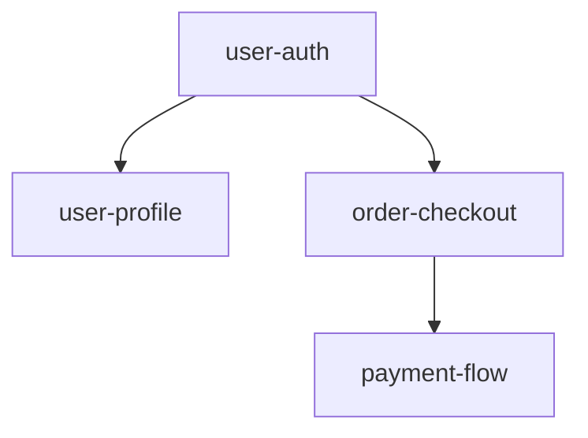

# sdd impact

Analyzes the impact of spec changes.

## Usage

```bash
sdd impact [spec-id] [options]
```

## Options

| Option | Description |
|--------|-------------|
| `--json` | Output in JSON format |
| `--depth <n>` | Analysis depth (default: 3) |
| `--code` | Include code impact |
| `--report` | Generate detailed report |

## Analysis Items

1. **Spec Dependencies**: Other specs that depend on this spec
2. **Code References**: Source code files that reference this spec
3. **Test Impact**: Related test files
4. **Domain Impact**: Affected domains

## Examples

### Basic Impact Analysis

```bash
sdd impact user-auth
```

Output:
```
=== Impact Analysis: user-auth ===

📊 Direct Dependencies:
  • user-profile (depends: user-auth)
  • order-checkout (depends: user-auth)

🔗 Indirect Dependencies (depth 2):
  • payment-flow → order-checkout → user-auth

📁 Related Code:
  • src/auth/login.ts
  • src/auth/session.ts
  • src/middleware/auth.ts

🧪 Related Tests:
  • tests/auth/login.test.ts
  • tests/integration/auth.test.ts

⚠️  Impact Summary:
  - Direct dependencies: 2 specs
  - Indirect dependencies: 1 spec
  - Code files: 3
  - Test files: 2
```

### JSON Output

```bash
sdd impact user-auth --json
```

```json
{
  "specId": "user-auth",
  "directDependents": ["user-profile", "order-checkout"],
  "indirectDependents": ["payment-flow"],
  "codeFiles": [
    "src/auth/login.ts",
    "src/auth/session.ts"
  ],
  "testFiles": [
    "tests/auth/login.test.ts"
  ],
  "summary": {
    "directCount": 2,
    "indirectCount": 1,
    "codeCount": 3,
    "testCount": 2
  }
}
```

### Include Code Impact

```bash
sdd impact user-auth --code
```

Output:
```
=== Code Impact Analysis: user-auth ===

📁 src/auth/login.ts
   Line 15: implements REQ-AUTH-001
   Line 42: implements REQ-AUTH-002

📁 src/auth/session.ts
   Line 8: implements REQ-AUTH-003

📁 src/middleware/auth.ts
   Line 23: depends on user-auth
```

### Generate Detailed Report

```bash
sdd impact user-auth --report
```

Creates `.sdd/reports/impact-user-auth.md` file.

## Impact Visualization

```bash
sdd impact user-auth --graph
```

Mermaid diagram output:


## Related Documentation

- [sdd change](/cli/change) - Change management
- [sdd domain](/cli/domain) - Domain management
- [sdd sync](/cli/sync) - Spec-code sync
