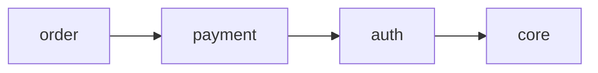

# /sdd.domain

A slash command for managing domains.

## Overview

`/sdd.domain` creates, views, modifies, and deletes domains in an SDD project. Use it to logically group specs in large projects.

## Usage

```
/sdd.domain create <name>     # Create domain
/sdd.domain list              # List domains
/sdd.domain show <name>       # Show details
/sdd.domain link <domain> <spec>  # Link spec
/sdd.domain graph             # Dependency graph
```

## Subcommands

### create

Create a new domain.

```
/sdd.domain create auth
/sdd.domain create payment --description "Payment processing"
```

### list

List all domains.

```
/sdd.domain list
/sdd.domain list --tree      # Tree format
```

### show

Display detailed information for a specific domain.

```
/sdd.domain show auth
```

**Output:**
- Domain description
- Linked specs list
- Dependency information

### link / unlink

Link or unlink specs to a domain.

```
/sdd.domain link auth user-login
/sdd.domain unlink auth user-login
```

### depends

Set dependencies between domains.

```
/sdd.domain depends payment --on auth
```

### graph

Visualize the domain dependency graph.

```
/sdd.domain graph              # Mermaid format
/sdd.domain graph --format dot # DOT format
```

**Example output:**


### delete / rename

Delete or rename a domain.

```
/sdd.domain delete legacy
/sdd.domain rename old-name new-name
```

### validate

Validate domain structure.

```
/sdd.domain validate
```

Validation items:
- Circular dependency detection
- Orphan spec detection
- Schema validity

## Example

```
User: /sdd.domain create auth --description "User authentication domain"

Claude: Domain created successfully!

auth
   Description: User authentication domain
   Path: .sdd/domains/auth/
   Specs: 0

Next step:
  /sdd.domain link auth <spec-name>

---

User: /sdd.domain graph

Claude: Domain dependency graph:

graph LR
  auth --> core
  payment --> auth
  order --> payment

Circular dependencies: none
```

## Related Commands

- [`sdd domain`](/cli/domain) - CLI version
- [`/sdd.context`](/commands/sdd-context) - Context setting
- [Domain System Guide](/guide/domains)
