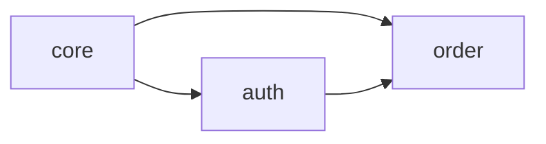

# Domain System

A guide to domain-based spec management.

## Overview

Domains are logical units for grouping related specs. They help systematically manage specs in large-scale projects.

## What is a Domain?

```
Project
├── auth/          # Authentication domain
│   ├── user-login
│   ├── oauth-google
│   └── session-management
├── order/         # Order domain
│   ├── create-order
│   ├── payment
│   └── refund
└── core/          # Core domain
    ├── data-model
    └── validation
```

## Domain Configuration

### domains.yml

Domains are defined in the `.sdd/domains.yml` file:

```yaml
version: "1.0"
domains:
  core:
    description: "Core functionality and common utilities"
    path: "src/core"
    specs:
      - data-model
      - common-utils

  auth:
    description: "Authentication and authorization"
    path: "src/auth"
    specs:
      - user-login
      - oauth-google
    dependencies:
      uses: [core]

  order:
    description: "Orders and payments"
    path: "src/order"
    specs:
      - create-order
      - payment
    dependencies:
      uses: [core, auth]
```

### Domain Properties

| Property | Description |
|----------|-------------|
| `description` | Domain description |
| `path` | Source code path |
| `specs` | Connected specs list |
| `dependencies` | Dependent domains |
| `owner` | Owner (optional) |
| `tags` | Tags (optional) |

## Domain Management

### Create Domain

```bash
# Basic creation
sdd domain create auth

# With options
sdd domain create auth \
  --description "Auth/Authz" \
  --path "src/auth" \
  --depends-on core
```

### Query Domains

```bash
# List domains
sdd domain list

# Detailed info
sdd domain show auth

# Dependency tree
sdd domain list --tree
```

### Link Specs

```bash
# Link spec to domain
sdd domain link auth user-login

# Unlink
sdd domain unlink auth user-login
```

### Set Dependencies

```bash
# Add dependency
sdd domain depends order --on auth

# Remove dependency
sdd domain depends order --on auth --remove
```

## Dependency Graph

### Visualization

```bash
# Mermaid format
sdd domain graph

# DOT format
sdd domain graph --format dot

# Save to file
sdd domain graph --output graph.md
```

### Output Example



### Circular Dependency Detection

Circular dependencies are automatically detected:

```
❌ Circular dependency detected: auth → order → payment → auth
```

## Domain Validation

```bash
# Validate all domains
sdd validate --domain

# Specific domain only
sdd validate --domain auth

# Check orphan specs
sdd validate --orphan-specs
```

### Validation Items

- Domain existence
- Spec-domain consistency
- Dependency rule compliance
- No circular dependencies

## Spec Creation and Domains

### Domain/Spec Format

```bash
sdd new mfa-setup -d auth
# → .sdd/specs/auth/mfa-setup/spec.md (v1.3.0)
```

This command:
1. Verifies `auth` domain exists
2. Creates spec in `.sdd/specs/auth/mfa-setup/` directory
3. Auto-updates domains.yml

::: tip v1.3.0 Structure
Specs are always created in `specs/<domain>/<feature>/spec.md` format.
If no domain is specified, it's created in the `common` domain.
:::

### Domain Auto-Detection

When context is set, domain is auto-detected:

```bash
sdd context set auth
sdd new mfa-setup  # Created as auth/mfa-setup
```

## Domain-Specific Templates

Custom templates can be defined for each domain:

```
.sdd/domains/auth/templates/
├── spec.md        # Spec template
└── scenario.md    # Scenario template
```

## Best Practices

### Domain Design Principles

1. **Single responsibility**: One domain for one business area
2. **Low coupling**: Minimize dependencies between domains
3. **High cohesion**: Related specs in the same domain

### Recommended Structure

```
├── core/           # Common functionality
├── auth/           # Authentication
├── user/           # User management
├── order/          # Orders
└── payment/        # Payments
```

### Patterns to Avoid

- Domains too large (10+ specs)
- Domains too small (1-2 specs)
- Bidirectional dependencies
- Circular dependencies

## Related Documentation

- [Context Guide](./context.md)
- [CLI: domain](../cli/domain.md)
- [Reverse Extraction Guide](./reverse-extraction.md)
