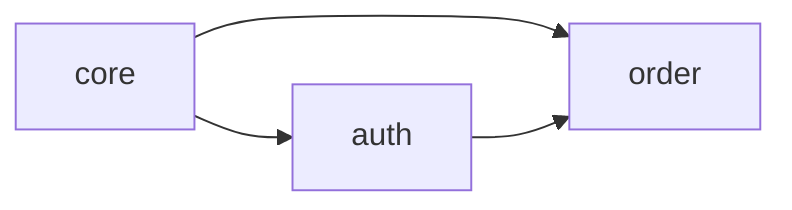

# 도메인 시스템

도메인 기반 스펙 관리에 대한 가이드입니다.

## 개요

도메인은 관련 스펙을 논리적으로 그룹화하는 단위입니다. 대규모 프로젝트에서 스펙을 체계적으로 관리할 수 있습니다.

## 도메인이란?

```
프로젝트
├── auth/          # 인증 도메인
│   ├── user-login
│   ├── oauth-google
│   └── session-management
├── order/         # 주문 도메인
│   ├── create-order
│   ├── payment
│   └── refund
└── core/          # 핵심 도메인
    ├── data-model
    └── validation
```

## 도메인 설정

### domains.yml

도메인은 `.sdd/domains.yml` 파일로 정의합니다:

```yaml
version: "1.0"
domains:
  core:
    description: "핵심 기능 및 공통 유틸리티"
    path: "src/core"
    specs:
      - data-model
      - common-utils

  auth:
    description: "인증 및 인가"
    path: "src/auth"
    specs:
      - user-login
      - oauth-google
    dependencies:
      uses: [core]

  order:
    description: "주문 및 결제"
    path: "src/order"
    specs:
      - create-order
      - payment
    dependencies:
      uses: [core, auth]
```

### 도메인 속성

| 속성 | 설명 |
|------|------|
| `description` | 도메인 설명 |
| `path` | 소스 코드 경로 |
| `specs` | 연결된 스펙 목록 |
| `dependencies` | 의존하는 도메인 |
| `owner` | 담당자 (선택) |
| `tags` | 태그 (선택) |

## 도메인 관리

### 도메인 생성

```bash
# 기본 생성
sdd domain create auth

# 옵션 포함
sdd domain create auth \
  --description "인증/인가" \
  --path "src/auth" \
  --depends-on core
```

### 도메인 조회

```bash
# 목록 조회
sdd domain list

# 상세 정보
sdd domain show auth

# 의존성 트리
sdd domain list --tree
```

### 스펙 연결

```bash
# 스펙을 도메인에 연결
sdd domain link auth user-login

# 연결 해제
sdd domain unlink auth user-login
```

### 의존성 설정

```bash
# 의존성 추가
sdd domain depends order --on auth

# 의존성 제거
sdd domain depends order --on auth --remove
```

## 의존성 그래프

### 시각화

```bash
# Mermaid 형식
sdd domain graph

# DOT 형식
sdd domain graph --format dot

# 파일로 저장
sdd domain graph --output graph.md
```

### 출력 예시



### 순환 의존성 감지

순환 의존성은 자동으로 감지됩니다:

```
❌ 순환 의존성 감지: auth → order → payment → auth
```

## 도메인 검증

```bash
# 모든 도메인 검증
sdd validate --domain

# 특정 도메인만
sdd validate --domain auth

# 고아 스펙 확인
sdd validate --orphan-specs
```

### 검증 항목

- 도메인 존재 여부
- 스펙-도메인 일관성
- 의존성 규칙 준수
- 순환 의존성 없음

## 스펙 생성과 도메인

### 도메인/스펙 형식

```bash
sdd new auth/mfa-setup
```

이 명령은:
1. `auth` 도메인 존재 확인
2. `auth/mfa-setup` 스펙 생성
3. domains.yml 자동 업데이트

### 도메인 자동 감지

컨텍스트가 설정된 경우 도메인을 자동 감지합니다:

```bash
sdd context set auth
sdd new mfa-setup  # auth/mfa-setup으로 생성
```

## 도메인별 템플릿

각 도메인에 커스텀 템플릿을 정의할 수 있습니다:

```
.sdd/domains/auth/templates/
├── spec.md        # 스펙 템플릿
└── scenario.md    # 시나리오 템플릿
```

## 모범 사례

### 도메인 설계 원칙

1. **단일 책임**: 하나의 도메인은 하나의 비즈니스 영역
2. **낮은 결합도**: 도메인 간 의존성 최소화
3. **높은 응집도**: 관련 스펙은 같은 도메인에

### 권장 구조

```
├── core/           # 공통 기능
├── auth/           # 인증
├── user/           # 사용자 관리
├── order/          # 주문
└── payment/        # 결제
```

### 피해야 할 패턴

- 너무 큰 도메인 (10+ 스펙)
- 너무 작은 도메인 (1-2 스펙)
- 양방향 의존성
- 순환 의존성

## 관련 문서

- [컨텍스트 가이드](./context.md)
- [CLI: domain](../cli/domain.md)
- [역추출 가이드](./reverse-extraction.md)
