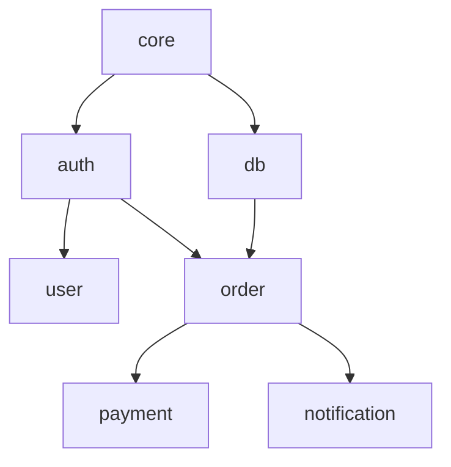

# Large Projects Guide

How to effectively use SDD in large-scale projects.

## Overview

Large-scale projects with hundreds of specs and multiple domains require systematic management. This guide covers domain, context, and dependency management strategies.

## Project Structure

### Recommended Structure

```
.sdd/
├── domains.yml              # Domain definitions
├── .context.json            # Current context
├── specs/
│   ├── core/               # Core domain
│   │   ├── data-model.md
│   │   └── validation.md
│   ├── auth/               # Auth domain
│   │   ├── user-login.md
│   │   └── oauth-google.md
│   ├── order/              # Order domain
│   │   ├── create-order.md
│   │   └── payment.md
│   └── ...
└── drafts/                 # Reverse extraction temp files
```

### Domain Hierarchy

```
Core layer (core)
    └── Infrastructure layer (infra, db)
        └── Business layer (auth, user)
            └── Feature layer (order, payment, notification)
```

## Domain Design

### Domain Separation Principles

1. **Single responsibility**: One business area
2. **Low coupling**: Minimize dependencies between domains
3. **High cohesion**: Related specs in same domain

### Domain Size

| Size | Spec Count | Recommended |
|------|------------|-------------|
| Small | 1-2 | Consider merging |
| Optimal | 3-10 | Recommended |
| Large | 10-20 | Consider splitting |
| Oversized | 20+ | Must split |

### Domain Dependencies

```yaml
# domains.yml
domains:
  core:
    specs: [data-model, validation, utils]

  auth:
    dependencies:
      uses: [core]
    specs: [user-login, oauth, session]

  order:
    dependencies:
      uses: [core, auth]
    specs: [create-order, payment, refund]
```

## Context Strategy

### During Feature Development

```bash
# Load only working domain
sdd context set auth
sdd list  # Shows only auth specs
```

### Cross-Domain Work

```bash
# Load related domains together
sdd context set order payment --include-deps
```

### Full Review

```bash
sdd context clear
sdd list --all
```

## Dependency Management

### Dependency Visualization

```bash
sdd domain graph
```



### Circular Dependency Prevention

```bash
sdd validate --domain
```

```
❌ Circular dependency detected: order → payment → order
   Solution: Merge payment as submodule of order or
             Extract common interface to core
```

### Dependency Rules

```yaml
# domains.yml
rules:
  - from: "feature/*"
    to: "core/*"
    allow: true

  - from: "core/*"
    to: "feature/*"
    allow: false
    message: "core cannot depend on feature"
```

## Team Collaboration

### Domain Ownership

```yaml
# domains.yml
domains:
  auth:
    owner: "@security-team"
    reviewers: ["@lead-dev"]

  payment:
    owner: "@payment-team"
    reviewers: ["@finance-lead", "@security-team"]
```

### Change Notifications

```bash
# Notify owner on domain changes
sdd notify --domain auth --message "OAuth spec added"
```

### Merge Conflict Prevention

```bash
# Lock domain before work
sdd domain lock auth --reason "OAuth refactoring"

# Release after work complete
sdd domain unlock auth
```

## Performance Optimization

### Incremental Validation

```bash
# Validate only changed specs
sdd validate --changed

# Validate specific domain only
sdd validate --domain auth
```

### Caching

```yaml
# .sdd/config.yml
cache:
  enabled: true
  ttl: 3600  # 1 hour
  path: .sdd/.cache/
```

### Parallel Processing

```bash
# Parallel processing by domain
sdd validate --parallel
```

## Version Management

### Spec Versions

```yaml
# spec.md frontmatter
version: "1.2.0"
deprecated: false
breaking_changes:
  - version: "1.0.0"
    description: "Initial version"
  - version: "1.2.0"
    description: "OAuth support added"
```

### Domain Versions

```yaml
# domains.yml
domains:
  auth:
    version: "2.0"
    min_compatible: "1.5"
```

## Migration

### Gradual Introduction

```bash
# Step 1: Start with core domain
sdd reverse scan src/core/
sdd reverse extract --domain core
sdd reverse finalize

# Step 2: Dependent domains
sdd reverse scan src/auth/
sdd reverse extract --domain auth
```

### Legacy Integration

```yaml
# domains.yml
domains:
  legacy:
    description: "Code awaiting migration"
    path: "src/legacy/"
    specs: []
    migrating: true
```

## Monitoring

### Progress Dashboard

```bash
sdd status --dashboard
```

```
📊 Project Status

Domains: 8
Specs: 47
  ✅ Implemented: 35 (74%)
  🔄 In Progress: 8 (17%)
  📝 Draft: 4 (9%)

Test Coverage: 82%
Last Changed: 3 days ago
```

### Quality Metrics

```bash
sdd metrics
```

```
📈 Quality Metrics

Spec Quality:
  - Average scenarios: 4.2/spec
  - Contract definition rate: 89%
  - Documentation rate: 95%

Domain Health:
  - auth: A (Excellent)
  - order: B (Good)
  - legacy: D (Needs improvement)
```

## Best Practices Summary

### DO

- Keep domains small and focused
- Clear dependency direction (core → feature)
- Actively use context
- Regular dependency reviews
- Specify domain ownership

### DON'T

- 20+ specs in one domain
- Allow circular dependencies
- Load entire project at once
- Ignore domain boundaries
- Domains without ownership

## Related Documentation

- [Domain System](./domains.md)
- [Context Guide](./context.md)
- [Reverse Extraction Guide](./reverse-extraction.md)
