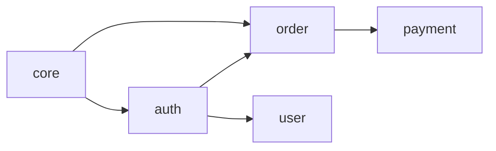

# sdd domain

도메인을 관리하고 의존성 그래프를 시각화합니다.

## 사용법

```bash
sdd domain <command> [options]
```

## 명령어

### create

새 도메인을 생성합니다.

```bash
sdd domain create <name> [options]
```

**옵션:**

| 옵션 | 설명 | 기본값 |
|------|------|--------|
| `--description`, `-d` | 도메인 설명 | - |
| `--path`, `-p` | 소스 코드 경로 | `src/<name>` |
| `--depends-on` | 의존하는 도메인 | - |
| `--owner` | 도메인 소유자 | - |
| `--tags` | 태그 (쉼표 구분) | - |

**예시:**

```bash
# 기본 생성
sdd domain create auth

# 상세 옵션
sdd domain create auth \
  --description "인증 및 인가" \
  --path "src/auth" \
  --depends-on core \
  --owner "@security-team"

# 여러 의존성
sdd domain create order \
  --depends-on core \
  --depends-on auth
```

### list

도메인 목록을 조회합니다.

```bash
sdd domain list [options]
```

**옵션:**

| 옵션 | 설명 |
|------|------|
| `--tree` | 의존성 트리로 표시 |
| `--json` | JSON 형식 출력 |
| `--verbose`, `-v` | 상세 정보 표시 |

**예시:**

```bash
sdd domain list
sdd domain list --tree
sdd domain list --json
```

**출력 예시:**

```
📁 도메인 목록 (5개)

  core       핵심 기능 및 공통 유틸리티     3 스펙
  auth       인증 및 인가                   4 스펙  → core
  user       사용자 관리                    2 스펙  → core, auth
  order      주문 및 결제                   5 스펙  → core, auth
  payment    결제 처리                      3 스펙  → core, order
```

### show

도메인 상세 정보를 표시합니다.

```bash
sdd domain show <name>
```

**출력 예시:**

```
📁 도메인: auth

설명: 인증 및 인가
경로: src/auth
소유자: @security-team

스펙 (4개):
  ✅ user-login
  ✅ oauth-google
  🔄 session-management
  📝 mfa-setup

의존성:
  사용: core
  사용됨: user, order

태그: security, authentication
```

### link

스펙을 도메인에 연결합니다.

```bash
sdd domain link <domain> <spec>
```

**예시:**

```bash
sdd domain link auth user-login
sdd domain link auth oauth-google oauth-apple
```

### unlink

스펙을 도메인에서 연결 해제합니다.

```bash
sdd domain unlink <domain> <spec>
```

**예시:**

```bash
sdd domain unlink auth legacy-login
```

### depends

도메인 의존성을 관리합니다.

```bash
sdd domain depends <domain> --on <target> [options]
```

**옵션:**

| 옵션 | 설명 |
|------|------|
| `--on` | 의존 대상 도메인 |
| `--remove` | 의존성 제거 |

**예시:**

```bash
# 의존성 추가
sdd domain depends order --on auth

# 의존성 제거
sdd domain depends order --on legacy --remove
```

### graph

의존성 그래프를 생성합니다.

```bash
sdd domain graph [options]
```

**옵션:**

| 옵션 | 설명 | 기본값 |
|------|------|--------|
| `--format` | 출력 형식 (mermaid, dot, json) | mermaid |
| `--output`, `-o` | 파일로 저장 | - |
| `--direction` | 방향 (TD, LR, BT, RL) | LR |

**예시:**

```bash
sdd domain graph
sdd domain graph --format dot
sdd domain graph --output graph.md
sdd domain graph --direction TD
```

**Mermaid 출력:**



### delete

도메인을 삭제합니다.

```bash
sdd domain delete <name> [options]
```

**옵션:**

| 옵션 | 설명 |
|------|------|
| `--force` | 확인 없이 삭제 |
| `--keep-specs` | 스펙은 유지 (도메인 연결만 해제) |

**예시:**

```bash
sdd domain delete legacy
sdd domain delete legacy --force
sdd domain delete legacy --keep-specs
```

### rename

도메인 이름을 변경합니다.

```bash
sdd domain rename <old-name> <new-name>
```

**예시:**

```bash
sdd domain rename auth authentication
```

### lock / unlock

도메인 잠금을 관리합니다.

```bash
sdd domain lock <name> [options]
sdd domain unlock <name>
```

**옵션:**

| 옵션 | 설명 |
|------|------|
| `--reason` | 잠금 사유 |
| `--until` | 잠금 기한 |

**예시:**

```bash
sdd domain lock auth --reason "OAuth 리팩토링 진행 중"
sdd domain unlock auth
```

## 전역 옵션

| 옵션 | 설명 |
|------|------|
| `--help`, `-h` | 도움말 표시 |
| `--quiet`, `-q` | 최소 출력 |
| `--json` | JSON 형식 출력 |

## 설정 파일

도메인은 `.sdd/domains.yml`에 저장됩니다:

```yaml
version: "1.0"
domains:
  core:
    description: "핵심 기능"
    path: "src/core"
    specs:
      - data-model
      - validation

  auth:
    description: "인증 및 인가"
    path: "src/auth"
    specs:
      - user-login
      - oauth-google
    dependencies:
      uses: [core]
    owner: "@security-team"
```

## 관련 문서

- [도메인 시스템 가이드](../guide/domains.md)
- [sdd context](./context.md)
- [sdd validate](./validate.md)
