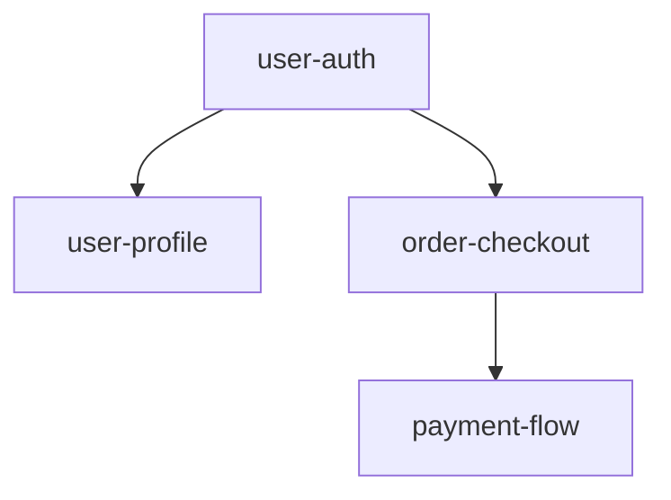

# sdd impact

스펙 변경의 영향도를 분석합니다.

## 사용법

```bash
sdd impact [spec-id] [options]
```

## 옵션

| 옵션 | 설명 |
|------|------|
| `--json` | JSON 형식으로 출력 |
| `--depth <n>` | 분석 깊이 (기본: 3) |
| `--code` | 코드 영향도 포함 |
| `--report` | 상세 리포트 생성 |

## 분석 항목

1. **스펙 의존성**: 해당 스펙에 의존하는 다른 스펙
2. **코드 참조**: 스펙을 참조하는 소스 코드 파일
3. **테스트 영향**: 관련 테스트 파일
4. **도메인 영향**: 영향받는 도메인

## 예시

### 기본 영향도 분석

```bash
sdd impact user-auth
```

출력:
```
=== 영향도 분석: user-auth ===

📊 직접 의존:
  • user-profile (depends: user-auth)
  • order-checkout (depends: user-auth)

🔗 간접 의존 (depth 2):
  • payment-flow → order-checkout → user-auth

📁 관련 코드:
  • src/auth/login.ts
  • src/auth/session.ts
  • src/middleware/auth.ts

🧪 관련 테스트:
  • tests/auth/login.test.ts
  • tests/integration/auth.test.ts

⚠️  영향 요약:
  - 직접 의존: 2개 스펙
  - 간접 의존: 1개 스펙
  - 코드 파일: 3개
  - 테스트 파일: 2개
```

### JSON 출력

```bash
sdd impact user-auth --json
```

```json
{
  "specId": "user-auth",
  "directDependents": ["user-profile", "order-checkout"],
  "indirectDependents": ["payment-flow"],
  "codeFiles": [
    "src/auth/login.ts",
    "src/auth/session.ts"
  ],
  "testFiles": [
    "tests/auth/login.test.ts"
  ],
  "summary": {
    "directCount": 2,
    "indirectCount": 1,
    "codeCount": 3,
    "testCount": 2
  }
}
```

### 코드 영향도 포함

```bash
sdd impact user-auth --code
```

출력:
```
=== 코드 영향도 분석: user-auth ===

📁 src/auth/login.ts
   Line 15: implements REQ-AUTH-001
   Line 42: implements REQ-AUTH-002

📁 src/auth/session.ts
   Line 8: implements REQ-AUTH-003

📁 src/middleware/auth.ts
   Line 23: depends on user-auth
```

### 상세 리포트 생성

```bash
sdd impact user-auth --report
```

`.sdd/reports/impact-user-auth.md` 파일이 생성됩니다.

## 영향도 시각화

```bash
sdd impact user-auth --graph
```

Mermaid 다이어그램 출력:


## 관련 문서

- [sdd change](/cli/change) - 변경 관리
- [sdd domain](/cli/domain) - 도메인 관리
- [sdd sync](/cli/sync) - 스펙-코드 동기화
