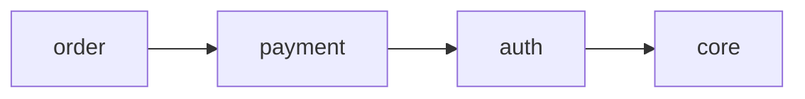

# /sdd.domain

도메인을 관리하는 슬래시 커맨드입니다.

## 개요

`/sdd.domain`은 SDD 프로젝트의 도메인을 생성, 조회, 수정, 삭제합니다. 대규모 프로젝트에서 스펙을 논리적으로 그룹화할 때 사용합니다.

## 사용법

```
/sdd.domain create <name>     # 도메인 생성
/sdd.domain list              # 도메인 목록
/sdd.domain show <name>       # 상세 정보
/sdd.domain link <domain> <spec>  # 스펙 연결
/sdd.domain graph             # 의존성 그래프
```

## 하위 명령어

### create

새 도메인을 생성합니다.

```
/sdd.domain create auth
/sdd.domain create payment --description "결제 처리"
```

### list

모든 도메인을 조회합니다.

```
/sdd.domain list
/sdd.domain list --tree      # 트리 형태
```

### show

특정 도메인의 상세 정보를 표시합니다.

```
/sdd.domain show auth
```

**출력:**
- 도메인 설명
- 연결된 스펙 목록
- 의존성 정보

### link / unlink

스펙을 도메인에 연결하거나 해제합니다.

```
/sdd.domain link auth user-login
/sdd.domain unlink auth user-login
```

### depends

도메인 간 의존성을 설정합니다.

```
/sdd.domain depends payment --on auth
```

### graph

도메인 의존성 그래프를 시각화합니다.

```
/sdd.domain graph              # Mermaid 형식
/sdd.domain graph --format dot # DOT 형식
```

**출력 예시:**


### delete / rename

도메인을 삭제하거나 이름을 변경합니다.

```
/sdd.domain delete legacy
/sdd.domain rename old-name new-name
```

### validate

도메인 구조를 검증합니다.

```
/sdd.domain validate
```

검증 항목:
- 순환 의존성 감지
- 고아 스펙 확인
- 스키마 유효성

## 예시

```
User: /sdd.domain create auth --description "사용자 인증 도메인"

Claude: ✅ 도메인 생성 완료!

📁 auth
   설명: 사용자 인증 도메인
   경로: .sdd/domains/auth/
   스펙: 0개

다음 단계:
  /sdd.domain link auth <spec-name>

---

User: /sdd.domain graph

Claude: 📊 도메인 의존성 그래프:

graph LR
  auth --> core
  payment --> auth
  order --> payment

순환 의존성: 없음 ✅
```

## 관련 명령어

- [`sdd domain`](/cli/domain) - CLI 버전
- [`/sdd.context`](/commands/sdd-context) - 컨텍스트 설정
- [도메인 시스템 가이드](/guide/domains)
