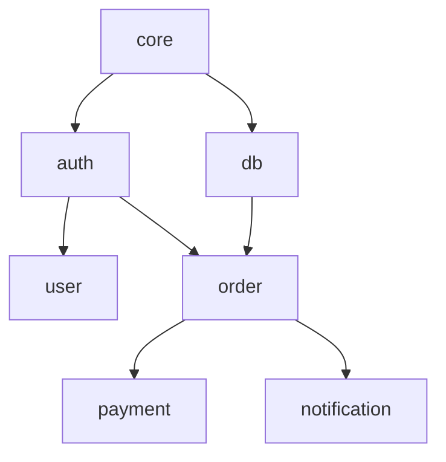

# 대규모 프로젝트 가이드

대규모 프로젝트에서 SDD를 효과적으로 사용하는 방법을 설명합니다.

## 개요

수백 개의 스펙과 여러 도메인이 있는 대규모 프로젝트에서는 체계적인 관리가 필요합니다. 이 가이드에서는 도메인, 컨텍스트, 의존성 관리 전략을 다룹니다.

## 프로젝트 구조

### 권장 구조

```
.sdd/
├── domains.yml              # 도메인 정의
├── .context.json            # 현재 컨텍스트
├── specs/
│   ├── core/               # 핵심 도메인
│   │   ├── data-model.md
│   │   └── validation.md
│   ├── auth/               # 인증 도메인
│   │   ├── user-login.md
│   │   └── oauth-google.md
│   ├── order/              # 주문 도메인
│   │   ├── create-order.md
│   │   └── payment.md
│   └── ...
└── drafts/                 # 역추출 임시 파일
```

### 도메인 계층

```
핵심 계층 (core)
    └── 인프라 계층 (infra, db)
        └── 비즈니스 계층 (auth, user)
            └── 기능 계층 (order, payment, notification)
```

## 도메인 설계

### 도메인 분리 원칙

1. **단일 책임**: 하나의 비즈니스 영역
2. **낮은 결합도**: 도메인 간 의존성 최소화
3. **높은 응집도**: 관련 스펙은 같은 도메인

### 도메인 크기

| 크기 | 스펙 수 | 권장 여부 |
|------|---------|----------|
| 작음 | 1-2개 | ⚠️ 병합 고려 |
| 적정 | 3-10개 | ✅ 권장 |
| 큼 | 10-20개 | ⚠️ 분할 고려 |
| 과대 | 20개+ | ❌ 분할 필요 |

### 도메인 의존성

```yaml
# domains.yml
domains:
  core:
    specs: [data-model, validation, utils]

  auth:
    dependencies:
      uses: [core]
    specs: [user-login, oauth, session]

  order:
    dependencies:
      uses: [core, auth]
    specs: [create-order, payment, refund]
```

## 컨텍스트 전략

### 기능 개발 시

```bash
# 작업할 도메인만 로드
sdd context set auth
sdd list  # auth 스펙만 표시
```

### 크로스 도메인 작업

```bash
# 관련 도메인 함께 로드
sdd context set order payment --include-deps
```

### 전체 검토 시

```bash
sdd context clear
sdd list --all
```

## 의존성 관리

### 의존성 시각화

```bash
sdd domain graph
```



### 순환 의존성 방지

```bash
sdd validate --domain
```

```
❌ 순환 의존성 감지: order → payment → order
   해결책: payment를 order의 하위 모듈로 병합하거나
          공통 인터페이스를 core로 추출
```

### 의존성 규칙

```yaml
# domains.yml
rules:
  - from: "feature/*"
    to: "core/*"
    allow: true

  - from: "core/*"
    to: "feature/*"
    allow: false
    message: "core는 feature에 의존할 수 없습니다"
```

## 팀 협업

### 도메인 소유권

```yaml
# domains.yml
domains:
  auth:
    owner: "@security-team"
    reviewers: ["@lead-dev"]

  payment:
    owner: "@payment-team"
    reviewers: ["@finance-lead", "@security-team"]
```

### 변경 알림

```bash
# 도메인 변경 시 소유자 알림
sdd notify --domain auth --message "OAuth 스펙 추가"
```

### 병합 충돌 방지

```bash
# 작업 전 도메인 잠금
sdd domain lock auth --reason "OAuth 리팩토링"

# 작업 완료 후 해제
sdd domain unlock auth
```

## 성능 최적화

### 증분 검증

```bash
# 변경된 스펙만 검증
sdd validate --changed

# 특정 도메인만 검증
sdd validate --domain auth
```

### 캐싱

```yaml
# .sdd/config.yml
cache:
  enabled: true
  ttl: 3600  # 1시간
  path: .sdd/.cache/
```

### 병렬 처리

```bash
# 도메인별 병렬 처리
sdd validate --parallel
```

## 버전 관리

### 스펙 버전

```yaml
# spec.md frontmatter
version: "1.2.0"
deprecated: false
breaking_changes:
  - version: "1.0.0"
    description: "초기 버전"
  - version: "1.2.0"
    description: "OAuth 지원 추가"
```

### 도메인 버전

```yaml
# domains.yml
domains:
  auth:
    version: "2.0"
    min_compatible: "1.5"
```

## 마이그레이션

### 점진적 도입

```bash
# 1단계: 핵심 도메인부터
sdd reverse scan src/core/
sdd reverse extract --domain core
sdd reverse finalize

# 2단계: 의존 도메인
sdd reverse scan src/auth/
sdd reverse extract --domain auth
```

### 레거시 통합

```yaml
# domains.yml
domains:
  legacy:
    description: "마이그레이션 대기 코드"
    path: "src/legacy/"
    specs: []
    migrating: true
```

## 모니터링

### 진행 상황 대시보드

```bash
sdd status --dashboard
```

```
📊 프로젝트 현황

도메인: 8개
스펙: 47개
  ✅ 구현됨: 35개 (74%)
  🔄 진행중: 8개 (17%)
  📝 초안: 4개 (9%)

테스트 커버리지: 82%
최근 변경: 3일 전
```

### 품질 지표

```bash
sdd metrics
```

```
📈 품질 지표

스펙 품질:
  - 시나리오 평균: 4.2개/스펙
  - 계약 정의율: 89%
  - 문서화율: 95%

도메인 건강도:
  - auth: A (우수)
  - order: B (양호)
  - legacy: D (개선 필요)
```

## 모범 사례 요약

### DO ✅

- 도메인을 작고 집중적으로 유지
- 의존성 방향을 명확히 (core → feature)
- 컨텍스트를 적극 활용
- 정기적인 의존성 검토
- 도메인 소유권 명시

### DON'T ❌

- 20개 이상 스펙을 한 도메인에
- 순환 의존성 허용
- 전체 프로젝트를 한 번에 로드
- 도메인 경계 무시
- 소유권 없는 도메인

## 관련 문서

- [도메인 시스템](./domains.md)
- [컨텍스트 가이드](./context.md)
- [역추출 가이드](./reverse-extraction.md)
