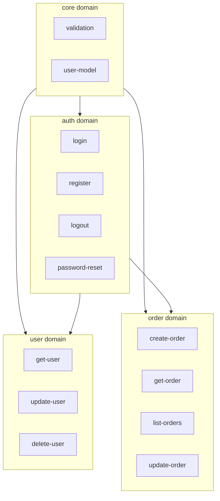

# Introducing SDD to Brownfield Projects

A tutorial for gradually introducing SDD to existing projects.

## Overview

A brownfield project is one with existing code. Through reverse extraction, you can extract specs from existing code and gradually introduce SDD.

> **Note**: This tutorial is based on an interactive workflow using slash commands in Claude Code.

## Scenario

Let's introduce SDD to an existing Express API project.

### Current Structure

```
my-api/
├── src/
│   ├── controllers/
│   │   ├── authController.js
│   │   ├── userController.js
│   │   └── orderController.js
│   ├── services/
│   │   ├── authService.js
│   │   ├── userService.js
│   │   └── orderService.js
│   ├── models/
│   │   ├── User.js
│   │   └── Order.js
│   └── utils/
│       └── validation.js
└── package.json
```

## Step 1: SDD Initialization

First, run the `sdd init` command in your terminal:

```bash
cd my-api
sdd init
```

```
SDD project has been initialized!

Created items:
  .sdd/specs/
  .sdd/changes/
  .sdd/archive/
  .sdd/templates/
  .claude/commands/    <- Slash commands
  .claude/skills/      <- Development skills
  .sdd/constitution.md
  .sdd/AGENTS.md

Existing code remains unchanged.
Next step: Run /sdd.start in Claude Code.
```

### Start in Claude Code

Now open the project in Claude Code and run `/sdd.start`:

```
/sdd.start
```

Claude analyzes the existing project:

```
Project Status

SDD Initialized
Constitution: Template (modification needed)
Specs: 0

Existing codebase detected:
- Files: 12
- Language: JavaScript

Tip: Run /sdd.reverse to extract specs from existing code.
```

## Step 2: Codebase Analysis

```
/sdd.reverse scan
```

Claude analyzes the codebase:

```
Scanning codebase...

Analysis results:

Files: 12
Language: JavaScript (100%)
Complexity: B (Good)

Inferred domains:
  auth (high confidence) - 2 files
     authController.js, authService.js
  user (high confidence) - 2 files
     userController.js, userService.js
  order (high confidence) - 2 files
     orderController.js, orderService.js
  core (medium confidence) - 2 files
     validation.js, models/

Spec candidates: 12
  High confidence (>80%): 8
  Medium confidence (50-80%): 3
  Low confidence (<50%): 1

Metadata saved: .sdd/.reverse-meta.json
Auto-generated domains: 4 (core, auth, user, order)

Tip: Next step: /sdd.reverse extract
```

## Step 3: Domain Creation

Design domains based on analysis results:

```
/sdd.domain
```

```
User: Create domain structure based on scan results

Claude: Domain Structure Proposal

Creating the following domains based on analysis results:

1. core
   Description: Common utilities
   Path: src/utils/
   Dependencies: none

2. auth
   Description: Authentication/authorization
   Path: src/controllers/auth*, src/services/auth*
   Dependencies: core

3. user
   Description: User management
   Path: src/controllers/user*, src/services/user*
   Dependencies: core, auth

4. order
   Description: Order management
   Path: src/controllers/order*, src/services/order*
   Dependencies: core, auth

Create these? [Y/n]

> Y

Domains created

Created files:
  .sdd/domains.yml              <- Domain configuration (YAML format)
  .sdd/domains/core/domain.md   <- Per-domain documentation
  .sdd/domains/auth/domain.md
  .sdd/domains/user/domain.md
  .sdd/domains/order/domain.md
```

## Step 4: Reverse Extraction

### Extract Specs

```
/sdd.reverse extract
```

Claude extracts specs from code:

```
Extracting specs...

## auth domain

### login (confidence: 95%)
Code location: authController.js:15-45, authService.js:10-35
Extracted scenarios:
  - Successful login with valid credentials
  - Failed login with wrong password
  - Non-existent user
Contract:
  Input: { email: string, password: string }
  Output: { token: string, user: User }

### register (confidence: 92%)
Code location: authController.js:47-80
Extracted scenarios:
  - Successful new user registration
  - Email duplicate error
  - Password format error

### logout (confidence: 88%)
...

## user domain

### get-user (confidence: 90%)
...

## order domain

### create-order (confidence: 88%)
...

━━━━━━━━━━━━━━━━━━━━━━━━━━━━━━━━━━━━━━━━
Total extracted specs: 11
Drafts saved: .sdd/drafts/

Start review? [Y/n]
```

## Step 5: Review Specs

```
/sdd.reverse review
```

Review extracted specs interactively with Claude:

```
Spec Review: auth/login (1/11)

━━━━━━━━━━━━━━━━━━━━━━━━━━━━━━━━━━━━━━━━
Name: login
Description: User login handling
Confidence: 95%
━━━━━━━━━━━━━━━━━━━━━━━━━━━━━━━━━━━━━━━━

Extracted scenarios:

1. Normal login
   GIVEN: Valid email and password
   WHEN: POST /auth/login request
   THEN: Return JWT token and user info

2. Password mismatch
   GIVEN: Valid email, wrong password
   WHEN: POST /auth/login request
   THEN: 401 error (INVALID_PASSWORD)

3. User not found
   GIVEN: Non-existent email
   WHEN: POST /auth/login request
   THEN: 404 error (USER_NOT_FOUND)

Extracted contract:
  Input: { email: string, password: string }
  Output: { token: string, user: User }

━━━━━━━━━━━━━━━━━━━━━━━━━━━━━━━━━━━━━━━━
AI Suggestions:
  - Add scenario: "Login attempt with locked account"
  - Contract improvement: Consider adding refreshToken

Needs clarification:
  - Is there a max login attempt limit?
  - What is the session expiration time?
━━━━━━━━━━━━━━━━━━━━━━━━━━━━━━━━━━━━━━━━

[a] Approve  [e] Edit  [s] Skip  [r] Reject
```

### Edit Example

```
> e

Entering edit mode

User: Add account lockout scenario. Lock for 30 minutes after 5 failures.

Claude: Scenario added

4. Account lockout
   GIVEN: Account with 5+ failed login attempts
   WHEN: POST /auth/login request
   THEN: 423 error (ACCOUNT_LOCKED, remaining time: 30 min)

Add this? [Y/n]

> Y

User: Also add refreshToken to output

Claude: Contract modified

Output:
  {
    token: string,
    refreshToken: string,  // Added
    user: User
  }

Apply this change? [Y/n]

> Y

Modification complete. Press [a] to approve.

> a

auth/login approved

Next spec: auth/register (2/11)
```

### Bulk Approval

```
User: Bulk approve all remaining with 85%+ confidence

Claude: Bulk approval targets

85%+ confidence:
  - auth/register (92%)
  - auth/logout (88%)
  - user/get-user (90%)
  - user/update-user (85%)
  - order/create-order (88%)
  - order/get-order (85%)

Approve 6 specs? [Y/n]

> Y

6 specs approved

Remaining specs: 4 (manual review needed)
  - user/delete-user (82%)
  - order/list-orders (80%)
  - order/update-order (75%)
  - order/cancel-order (72%)
```

## Step 6: Finalize Specs

```
/sdd.reverse finalize
```

```
Spec Finalization

Approved specs: 8
Manual review needed: 4

Finalize approved specs? [Y/n]

> Y

Specs finalized

Saved specs:
  .sdd/specs/login/spec.md (domain: auth)
  .sdd/specs/register/spec.md (domain: auth)
  .sdd/specs/logout/spec.md (domain: auth)
  .sdd/specs/get-user/spec.md (domain: user)
  .sdd/specs/update-user/spec.md (domain: user)
  .sdd/specs/create-order/spec.md (domain: order)
  .sdd/specs/get-order/spec.md (domain: order)
  .sdd/specs/validation/spec.md (domain: core)

domains.yml updated
Draft files cleaned up

Remaining drafts: .sdd/drafts/ (4)
```

## Step 7: Validation

```
/sdd.validate
```

```
Validation complete

Specs: 8
Domains: 4
Dependencies: Valid

Warnings: 2
  - login: Output type User not defined in core
  - create-order: Possible missing dependency on payment

Errors: 0
```

### Resolve Warnings

```
User: Add User type spec and resolve the warning

Claude: Spec added

Creating user-model spec (domain: core):

  ---
  id: user-model
  name: User Model
  status: approved
  domain: core
  ---

  # User Model

  interface User {
    id: string;
    email: string;
    name: string;
    createdAt: Date;
    updatedAt: Date;
  }

Adding user-model to login's dependencies

Warning resolved
```

## Step 8: Check Project Status

```
/sdd.status
```

```
Project Status: my-api

Specs: 9
  Implemented (legacy): 9 (100%)
  Tests needed: 4
  Spec enhancement needed: 2

Domains:
  core: 2/2 complete 100%
  auth: 3/3 complete 100%
  user: 2/3 complete  67%
  order: 2/4 complete  50%

Drafts (unfinalized): 4
  -> Continue review with /sdd.reverse review

Recommended next actions:
  1. Review remaining drafts: /sdd.reverse review
  2. Add tests: "Write tests for auth/login"
  3. New features: /sdd.spec
```

## Step 9: Gradual Improvement

### Add Tests

Add tests to existing code:

```
User: login has no tests. Write tests based on the spec

Claude: Generating tests: login (domain: auth)

Generating tests based on spec scenarios:

src/auth/login.test.ts:

  import { describe, it, expect, beforeEach, vi } from 'vitest';
  import { login } from './authService';
  import { User } from '../models/User';

  describe('login', () => {
    beforeEach(() => {
      vi.clearAllMocks();
    });

    it('successfully logs in with valid credentials', async () => {
      const result = await login({
        email: 'user@test.com',
        password: 'valid-password'
      });

      expect(result.token).toBeDefined();
      expect(result.refreshToken).toBeDefined();
      expect(result.user.email).toBe('user@test.com');
    });

    it('returns 401 with wrong password', async () => {
      await expect(login({
        email: 'user@test.com',
        password: 'wrong-password'
      })).rejects.toThrow('INVALID_PASSWORD');
    });

    it('returns 404 for non-existent user', async () => {
      await expect(login({
        email: 'unknown@test.com',
        password: 'any-password'
      })).rejects.toThrow('USER_NOT_FOUND');
    });

    it('locks account after 5 failures', async () => {
      // Simulate 5 failures
      for (let i = 0; i < 5; i++) {
        await expect(login({
          email: 'user@test.com',
          password: 'wrong'
        })).rejects.toThrow();
      }

      await expect(login({
        email: 'user@test.com',
        password: 'correct'
      })).rejects.toThrow('ACCOUNT_LOCKED');
    });
  });

Create test file? [Y/n]
```

### Add New Features

Develop new features using SDD from the start:

```
/sdd.spec Password reset
```

```
Writing new spec: password-reset (domain: auth)

Tell me about the functionality:
- Send reset link via email
- Set new password when clicking link
- What is the link validity period?

User: Send link via email, valid for 1 hour. New password must be 8+ characters.

Claude: Spec Draft

## password-reset (domain: auth)

### Scenarios

**Reset request**
- GIVEN: Registered email
- WHEN: POST /auth/password-reset/request
- THEN: Reset link sent via email

**Password change**
- GIVEN: Valid reset token, new password (8+ chars)
- WHEN: POST /auth/password-reset/confirm
- THEN: Password changed

**Expired token**
- GIVEN: Token older than 1 hour
- WHEN: POST /auth/password-reset/confirm
- THEN: 400 error (TOKEN_EXPIRED)

Save this spec? [Y/n]
```

## Step 10: Ongoing Management

### Check Code-Spec Synchronization

```
/sdd.sync
```

```
Spec-Code Sync Check

Synchronized: 7
  - login (domain: auth)
  - register (domain: auth)
  - logout (domain: auth)
  ...

Mismatch: 2
  - update-user (domain: user)
    Spec: email field modifiable
    Code: email is readonly
    -> Spec or code modification needed

  - create-order (domain: order)
    Spec: quantity required
    Code: quantity defaults to 1
    -> Spec update recommended

Fix these? [Y/n]
```

### Domain Graph

```
/sdd.domain graph
```



## Next Steps

1. Add tests to verify specs
2. Develop new features using SDD
3. Gradually refactor legacy code

## Related Documentation

- [Reverse Extraction Guide](/guide/reverse-extraction)
- [Domain System](/guide/domains)
- [Large-scale Projects](/guide/large-projects)

## Summary

1. Initialize project with `sdd init` (CLI)
2. Check project status with `/sdd.start` (Claude Code)
3. Analyze codebase with `/sdd.reverse scan`
4. Create domain structure with `/sdd.domain`
5. Extract specs with `/sdd.reverse extract`
6. Interactive review with `/sdd.reverse review`
7. Finalize with `/sdd.reverse finalize`
8. Validate with `/sdd.validate`
9. Manage code-spec sync with `/sdd.sync`
10. Gradually add tests and improvements
