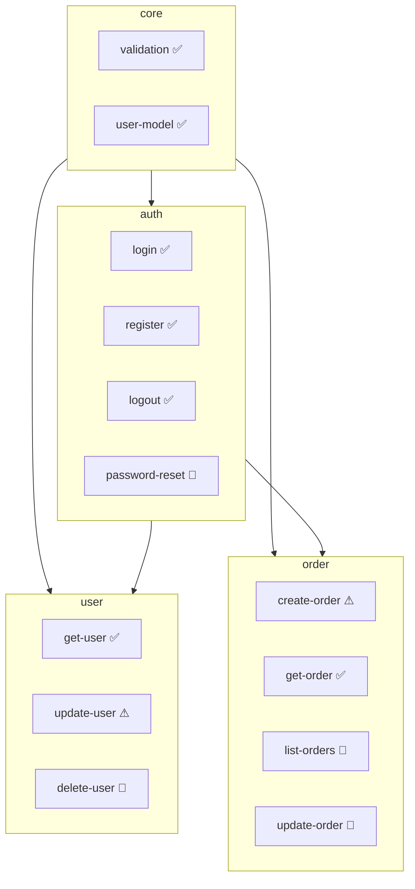

# 브라운필드 프로젝트에 SDD 도입하기

기존 프로젝트에 SDD를 점진적으로 도입하는 튜토리얼입니다.

## 개요

브라운필드(Brownfield) 프로젝트는 이미 코드가 존재하는 프로젝트입니다. 역추출(Reverse Extraction)을 통해 기존 코드에서 스펙을 추출하고, 점진적으로 SDD를 도입할 수 있습니다.

> **Note**: 이 튜토리얼은 Claude Code에서 슬래시 커맨드를 사용하는 대화형 워크플로우를 기반으로 합니다.

## 시나리오

기존 Express API 프로젝트에 SDD를 도입해보겠습니다.

### 현재 구조

```
my-api/
├── src/
│   ├── controllers/
│   │   ├── authController.js
│   │   ├── userController.js
│   │   └── orderController.js
│   ├── services/
│   │   ├── authService.js
│   │   ├── userService.js
│   │   └── orderService.js
│   ├── models/
│   │   ├── User.js
│   │   └── Order.js
│   └── utils/
│       └── validation.js
└── package.json
```

## Step 1: SDD 초기화

먼저 터미널에서 `sdd init` 명령어를 실행합니다:

```bash
cd my-api
sdd init
```

```
✅ SDD 프로젝트가 초기화되었습니다!

생성된 항목:
  📁 .sdd/specs/
  📁 .sdd/changes/
  📁 .sdd/archive/
  📁 .sdd/templates/
  📁 .claude/commands/    ← 슬래시 커맨드
  📁 .claude/skills/      ← 개발 스킬
  📄 .sdd/constitution.md
  📄 .sdd/AGENTS.md

기존 코드는 그대로 유지됩니다.
다음 단계: Claude Code에서 /sdd.start 를 실행하세요.
```

### Claude Code에서 시작

이제 Claude Code에서 프로젝트를 열고 `/sdd.start`를 실행합니다:

```
/sdd.start
```

Claude가 기존 프로젝트를 분석합니다:

```
📂 프로젝트 상태

✅ SDD 초기화됨
📜 Constitution: 템플릿 (수정 필요)
📋 스펙: 0개

기존 코드베이스 감지:
- 파일: 12개
- 언어: JavaScript

💡 기존 코드에서 스펙을 추출하려면 /sdd.reverse 를 실행하세요.
```

## Step 2: 코드베이스 분석

```
/sdd.reverse scan
```

Claude가 코드베이스를 분석합니다:

```
🔍 코드베이스 스캔 중...

분석 결과:

파일: 12개
언어: JavaScript (100%)
복잡도: B (양호)

추정 도메인:
  📁 auth (높음) - 2개 파일
     authController.js, authService.js
  📁 user (높음) - 2개 파일
     userController.js, userService.js
  📁 order (높음) - 2개 파일
     orderController.js, orderService.js
  📁 core (중간) - 2개 파일
     validation.js, models/

스펙 후보: 12개
  높은 신뢰도 (>80%): 8개
  중간 신뢰도 (50-80%): 3개
  낮은 신뢰도 (<50%): 1개

도메인 구조를 생성하시겠습니까? [Y/n]
```

## Step 3: 도메인 생성

분석 결과를 바탕으로 도메인을 설계합니다:

```
/sdd.domain
```

```
User: 스캔 결과를 바탕으로 도메인 구조를 만들어줘

Claude: 📁 도메인 구조 제안

분석 결과를 기반으로 다음 도메인을 생성합니다:

1. core
   설명: 공통 유틸리티
   경로: src/utils/
   의존성: 없음

2. auth
   설명: 인증/인가
   경로: src/controllers/auth*, src/services/auth*
   의존성: core

3. user
   설명: 사용자 관리
   경로: src/controllers/user*, src/services/user*
   의존성: core, auth

4. order
   설명: 주문 관리
   경로: src/controllers/order*, src/services/order*
   의존성: core, auth

생성하시겠습니까? [Y/n]

> Y

✅ 도메인 생성 완료

domains.yml이 생성되었습니다.
```

## Step 4: 역추출 실행

### 스펙 추출

```
/sdd.reverse extract
```

Claude가 코드에서 스펙을 추출합니다:

```
📝 스펙 추출 중...

## auth 도메인

### login (신뢰도: 95%)
코드 위치: authController.js:15-45, authService.js:10-35
추출된 시나리오:
  - 유효한 자격증명으로 로그인 성공
  - 잘못된 비밀번호로 로그인 실패
  - 존재하지 않는 사용자
계약:
  입력: { email: string, password: string }
  출력: { token: string, user: User }

### register (신뢰도: 92%)
코드 위치: authController.js:47-80
추출된 시나리오:
  - 신규 사용자 등록 성공
  - 이메일 중복 에러
  - 비밀번호 형식 에러

### logout (신뢰도: 88%)
...

## user 도메인

### get-user (신뢰도: 90%)
...

## order 도메인

### create-order (신뢰도: 88%)
...

━━━━━━━━━━━━━━━━━━━━━━━━━━━━━━━━━━━━━━━━
총 추출된 스펙: 11개
초안 저장: .sdd/drafts/

리뷰를 시작하시겠습니까? [Y/n]
```

## Step 5: 스펙 검토

```
/sdd.reverse review
```

Claude와 대화형으로 추출된 스펙을 검토합니다:

```
📋 스펙 검토: auth/login (1/11)

━━━━━━━━━━━━━━━━━━━━━━━━━━━━━━━━━━━━━━━━
이름: login
설명: 사용자 로그인 처리
신뢰도: 95%
━━━━━━━━━━━━━━━━━━━━━━━━━━━━━━━━━━━━━━━━

추출된 시나리오:

1. 정상 로그인
   GIVEN: 유효한 이메일과 비밀번호
   WHEN: POST /auth/login 요청
   THEN: JWT 토큰과 사용자 정보 반환

2. 비밀번호 불일치
   GIVEN: 유효한 이메일, 잘못된 비밀번호
   WHEN: POST /auth/login 요청
   THEN: 401 에러 (INVALID_PASSWORD)

3. 사용자 없음
   GIVEN: 존재하지 않는 이메일
   WHEN: POST /auth/login 요청
   THEN: 404 에러 (USER_NOT_FOUND)

추출된 계약:
  입력: { email: string, password: string }
  출력: { token: string, user: User }

━━━━━━━━━━━━━━━━━━━━━━━━━━━━━━━━━━━━━━━━
💡 AI 제안:
  - 시나리오 추가: "계정 잠금 상태에서 로그인 시도"
  - 계약 개선: refreshToken 추가 권장

❓ 확인 필요:
  - 로그인 실패 시 최대 시도 횟수 제한이 있나요?
  - 세션 만료 시간은 어떻게 되나요?
━━━━━━━━━━━━━━━━━━━━━━━━━━━━━━━━━━━━━━━━

[a] 승인  [e] 편집  [s] 건너뛰기  [r] 거부
```

### 편집 예시

```
> e

편집 모드 진입

User: 계정 잠금 시나리오 추가해줘. 5회 실패 시 30분 잠금이야.

Claude: 📝 시나리오 추가

4. 계정 잠금
   GIVEN: 5회 이상 로그인 실패한 계정
   WHEN: POST /auth/login 요청
   THEN: 423 에러 (ACCOUNT_LOCKED, 남은 시간: 30분)

추가하시겠습니까? [Y/n]

> Y

User: refreshToken도 출력에 추가해

Claude: 📝 계약 수정

출력:
  {
    token: string,
    refreshToken: string,  // 추가됨
    user: User
  }

수정하시겠습니까? [Y/n]

> Y

✅ 수정 완료. [a]로 승인하세요.

> a

✅ auth/login 승인됨

다음 스펙: auth/register (2/11)
```

### 일괄 승인

```
User: 나머지 중 신뢰도 85% 이상은 일괄 승인해줘

Claude: 📋 일괄 승인 대상

신뢰도 85% 이상:
  ✓ auth/register (92%)
  ✓ auth/logout (88%)
  ✓ user/get-user (90%)
  ✓ user/update-user (85%)
  ✓ order/create-order (88%)
  ✓ order/get-order (85%)

6개 스펙을 승인하시겠습니까? [Y/n]

> Y

✅ 6개 스펙 승인됨

남은 스펙: 4개 (수동 검토 필요)
  - user/delete-user (82%)
  - order/list-orders (80%)
  - order/update-order (75%)
  - order/cancel-order (72%)
```

## Step 6: 스펙 확정

```
/sdd.reverse finalize
```

```
📦 스펙 확정

승인된 스펙: 8개
수동 검토 필요: 4개

승인된 스펙을 확정하시겠습니까? [Y/n]

> Y

✅ 스펙 확정 완료

저장된 스펙:
  .sdd/specs/auth/login.md
  .sdd/specs/auth/register.md
  .sdd/specs/auth/logout.md
  .sdd/specs/user/get-user.md
  .sdd/specs/user/update-user.md
  .sdd/specs/order/create-order.md
  .sdd/specs/order/get-order.md
  .sdd/specs/core/validation.md

domains.yml 업데이트됨
초안 파일 정리됨

남은 초안: .sdd/drafts/ (4개)
```

## Step 7: 검증

```
/sdd.validate
```

```
✅ 검증 완료

스펙: 8개
도메인: 4개
의존성: 유효

경고: 2개
  ⚠ auth/login: 출력 타입 User가 core에 정의되지 않음
  ⚠ order/create-order: 의존성 payment 누락 가능성

오류: 0개
```

### 경고 해결

```
User: User 타입 스펙을 추가하고 경고 해결해줘

Claude: 📝 스펙 추가

core/user-model 스펙을 생성합니다:

---
id: core/user-model
name: 사용자 모델
status: approved
---

# 사용자 모델

```typescript
interface User {
  id: string;
  email: string;
  name: string;
  createdAt: Date;
  updatedAt: Date;
}
```

auth/login의 의존성에 core/user-model 추가

✅ 경고 해결됨
```

## Step 8: 프로젝트 상태 확인

```
/sdd.status
```

```
📊 프로젝트 현황: my-api

스펙: 9개
  ✅ 구현됨 (레거시): 9개 (100%)
  📋 테스트 추가 필요: 4개
  📝 스펙 보강 필요: 2개

도메인:
  core: 2/2 완료 ████████████ 100%
  auth: 3/3 완료 ████████████ 100%
  user: 2/3 완료 ████████░░░░ 67%
  order: 2/4 완료 ██████░░░░░░ 50%

초안 (미확정): 4개
  → /sdd.reverse review 로 검토 계속

다음 추천 작업:
  1. 남은 초안 검토: /sdd.reverse review
  2. 테스트 추가: "auth/login 테스트 작성해줘"
  3. 새 기능: /sdd.new
```

## Step 9: 점진적 개선

### 테스트 추가

기존 코드에 테스트를 추가합니다:

```
User: auth/login에 테스트가 없어. 스펙 기반으로 테스트 작성해줘

Claude: 🧪 테스트 생성: auth/login

스펙의 시나리오를 기반으로 테스트를 생성합니다:

src/auth/login.test.ts:
```typescript
import { describe, it, expect, beforeEach, vi } from 'vitest';
import { login } from './authService';
import { User } from '../models/User';

describe('login', () => {
  beforeEach(() => {
    vi.clearAllMocks();
  });

  it('유효한 자격증명으로 로그인 성공', async () => {
    const result = await login({
      email: 'user@test.com',
      password: 'valid-password'
    });

    expect(result.token).toBeDefined();
    expect(result.refreshToken).toBeDefined();
    expect(result.user.email).toBe('user@test.com');
  });

  it('잘못된 비밀번호로 401 에러', async () => {
    await expect(login({
      email: 'user@test.com',
      password: 'wrong-password'
    })).rejects.toThrow('INVALID_PASSWORD');
  });

  it('존재하지 않는 사용자로 404 에러', async () => {
    await expect(login({
      email: 'unknown@test.com',
      password: 'any-password'
    })).rejects.toThrow('USER_NOT_FOUND');
  });

  it('5회 실패 후 계정 잠금', async () => {
    // 5회 실패 시뮬레이션
    for (let i = 0; i < 5; i++) {
      await expect(login({
        email: 'user@test.com',
        password: 'wrong'
      })).rejects.toThrow();
    }

    await expect(login({
      email: 'user@test.com',
      password: 'correct'
    })).rejects.toThrow('ACCOUNT_LOCKED');
  });
});
```

테스트 파일을 생성하시겠습니까? [Y/n]
```

### 새 기능 추가

새 기능은 처음부터 SDD 방식으로 개발합니다:

```
/sdd.new 비밀번호 재설정
```

```
📝 새 스펙 작성: auth/password-reset

기능 설명을 알려주세요:
- 이메일로 재설정 링크 발송
- 링크 클릭 시 새 비밀번호 설정
- 링크 유효 시간은?

User: 이메일로 링크 보내고, 1시간 유효해. 새 비밀번호는 8자 이상이어야 해.

Claude: 📋 스펙 초안

## auth/password-reset

### 시나리오

**재설정 요청**
- GIVEN: 등록된 이메일
- WHEN: POST /auth/password-reset/request
- THEN: 재설정 링크가 이메일로 발송됨

**비밀번호 변경**
- GIVEN: 유효한 재설정 토큰, 새 비밀번호 (8자 이상)
- WHEN: POST /auth/password-reset/confirm
- THEN: 비밀번호가 변경됨

**만료된 토큰**
- GIVEN: 1시간 초과된 토큰
- WHEN: POST /auth/password-reset/confirm
- THEN: 400 에러 (TOKEN_EXPIRED)

스펙을 저장하시겠습니까? [Y/n]
```

## Step 10: 지속적인 관리

### 코드와 스펙 동기화 확인

```
/sdd.sync
```

```
🔄 스펙-코드 동기화 검사

✅ 동기화됨: 7개
  - auth/login
  - auth/register
  - auth/logout
  ...

⚠ 불일치: 2개
  - user/update-user
    스펙: email 필드 수정 가능
    코드: email 수정 불가 (readonly)
    → 스펙 또는 코드 수정 필요

  - order/create-order
    스펙: quantity 필수
    코드: quantity 기본값 1
    → 스펙 업데이트 권장

수정하시겠습니까? [Y/n]
```

### 도메인 그래프

```
/sdd.domain graph
```



## 다음 단계

1. 테스트 추가로 스펙 검증
2. 새 기능은 SDD 방식으로 개발
3. 점진적으로 레거시 코드 리팩토링

## 관련 문서

- [역추출 가이드](/guide/reverse-extraction)
- [도메인 시스템](/guide/domains)
- [대규모 프로젝트](/guide/large-projects)

## 요약

1. `sdd init`으로 프로젝트 초기화 (CLI)
2. `/sdd.start`로 프로젝트 상태 확인 (Claude Code)
3. `/sdd.reverse scan`으로 코드베이스 분석
4. `/sdd.domain`으로 도메인 구조 생성
5. `/sdd.reverse extract`로 스펙 추출
6. `/sdd.reverse review`로 대화형 검토
7. `/sdd.reverse finalize`로 확정
8. `/sdd.validate`로 검증
9. `/sdd.sync`로 코드-스펙 동기화 관리
10. 점진적으로 테스트 추가 및 개선
