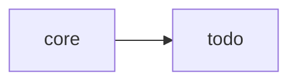

# 그린필드 프로젝트 시작하기

새 프로젝트를 SDD 방식으로 시작하는 튜토리얼입니다.

## 개요

그린필드(Greenfield) 프로젝트는 처음부터 새로 시작하는 프로젝트입니다. SDD를 처음부터 적용하면 명세와 구현이 일치하는 고품질 코드베이스를 만들 수 있습니다.

## 시나리오

간단한 할 일 관리 API를 만들어보겠습니다.

## Step 1: 프로젝트 초기화

### 프로젝트 생성

```bash
mkdir todo-api
cd todo-api
npm init -y
```

### SDD 초기화

```bash
sdd init
```

생성되는 구조:

```
todo-api/
├── .sdd/
│   ├── config.yml          # SDD 설정
│   ├── domains.yml         # 도메인 정의
│   └── specs/              # 스펙 저장소
├── CLAUDE.md               # AI 지침
└── package.json
```

## Step 2: 도메인 설계

### 도메인 식별

할 일 API의 주요 도메인:

- **core**: 공통 유틸리티
- **todo**: 할 일 관리
- **user**: 사용자 관리 (선택)

### 도메인 생성

```bash
sdd domain create core --description "공통 유틸리티 및 타입"
sdd domain create todo --description "할 일 CRUD" --depends-on core
```

## Step 3: 첫 번째 스펙 작성

### 스펙 생성

```bash
sdd new todo/create-todo
```

### 스펙 내용

`.sdd/specs/todo/create-todo.md`:

```markdown
---
id: todo/create-todo
name: 할 일 생성
status: draft
priority: high
---

# 할 일 생성

새로운 할 일 항목을 생성합니다.

## 시나리오

### 정상 생성

**GIVEN** 유효한 할 일 데이터
**WHEN** 생성 요청
**THEN** 새 할 일이 생성되고 ID가 반환됨

### 제목 누락

**GIVEN** 제목이 없는 데이터
**WHEN** 생성 요청
**THEN** 400 에러 반환

### 제목 길이 초과

**GIVEN** 200자 초과 제목
**WHEN** 생성 요청
**THEN** 400 에러 반환

## 계약

### 입력

```typescript
interface CreateTodoInput {
  title: string;        // 1-200자
  description?: string; // 선택
  dueDate?: Date;       // 선택
}
```

### 출력

```typescript
interface Todo {
  id: string;
  title: string;
  description?: string;
  dueDate?: Date;
  completed: boolean;
  createdAt: Date;
}
```

## 의존성

- core/validation
```

## Step 4: 관련 스펙 추가

### core 도메인 스펙

```bash
sdd new core/validation
```

`.sdd/specs/core/validation.md`:

```markdown
---
id: core/validation
name: 입력 검증
status: draft
---

# 입력 검증

공통 검증 유틸리티입니다.

## 시나리오

### 문자열 길이 검증

**GIVEN** 최소/최대 길이 설정
**WHEN** 문자열 검증 요청
**THEN** 범위 내면 true, 아니면 false

### 필수 필드 검증

**GIVEN** 필수 필드 목록
**WHEN** 객체 검증 요청
**THEN** 누락 필드 목록 반환

## 계약

```typescript
interface ValidationResult {
  valid: boolean;
  errors: string[];
}

function validateLength(
  value: string,
  min: number,
  max: number
): ValidationResult;

function validateRequired(
  obj: Record<string, unknown>,
  fields: string[]
): ValidationResult;
```
```

### 추가 스펙

```bash
sdd new todo/get-todo
sdd new todo/update-todo
sdd new todo/delete-todo
sdd new todo/list-todos
```

## Step 5: 스펙 검증

```bash
sdd validate
```

```
✅ 검증 완료

스펙: 6개
  ✅ core/validation
  ✅ todo/create-todo
  ✅ todo/get-todo
  ✅ todo/update-todo
  ✅ todo/delete-todo
  ✅ todo/list-todos

경고: 0개
오류: 0개
```

## Step 6: 의존성 확인

```bash
sdd domain graph
```



```bash
sdd list --tree
```

```
todo-api
├── core/
│   └── validation
└── todo/
    ├── create-todo → core/validation
    ├── get-todo
    ├── update-todo → core/validation
    ├── delete-todo
    └── list-todos
```

## Step 7: 구현 시작

### TDD 방식

1. 스펙의 시나리오를 테스트로 변환
2. 테스트 실행 (실패 확인)
3. 구현
4. 테스트 통과 확인

### 예시: validation 구현

`src/core/validation.ts`:

```typescript
export interface ValidationResult {
  valid: boolean;
  errors: string[];
}

export function validateLength(
  value: string,
  min: number,
  max: number
): ValidationResult {
  const errors: string[] = [];

  if (value.length < min) {
    errors.push(`최소 ${min}자 이상이어야 합니다`);
  }
  if (value.length > max) {
    errors.push(`최대 ${max}자까지 가능합니다`);
  }

  return { valid: errors.length === 0, errors };
}

export function validateRequired(
  obj: Record<string, unknown>,
  fields: string[]
): ValidationResult {
  const errors: string[] = [];

  for (const field of fields) {
    if (obj[field] === undefined || obj[field] === null) {
      errors.push(`${field}는 필수입니다`);
    }
  }

  return { valid: errors.length === 0, errors };
}
```

### 스펙 상태 업데이트

```bash
sdd status update core/validation --implemented
```

## Step 8: 반복

나머지 스펙도 같은 방식으로:

1. 스펙 검토
2. 테스트 작성
3. 구현
4. 상태 업데이트

## 진행 상황 확인

```bash
sdd status
```

```
📊 프로젝트 현황

스펙: 6개
  ✅ 구현됨: 2개 (33%)
  🔄 진행중: 1개 (17%)
  📝 초안: 3개 (50%)

도메인:
  core: 1/1 완료
  todo: 1/5 완료
```

## 다음 단계

- [스펙 작성 가이드](/spec-writing/)
- [워크플로우 가이드](/guide/workflow)
- [CI/CD 설정](/guide/cicd-setup)

## 요약

1. `sdd init`으로 프로젝트 초기화
2. 도메인 설계 및 생성
3. 핵심 스펙부터 작성
4. 의존성 순서대로 구현
5. 상태 업데이트로 진행 추적
