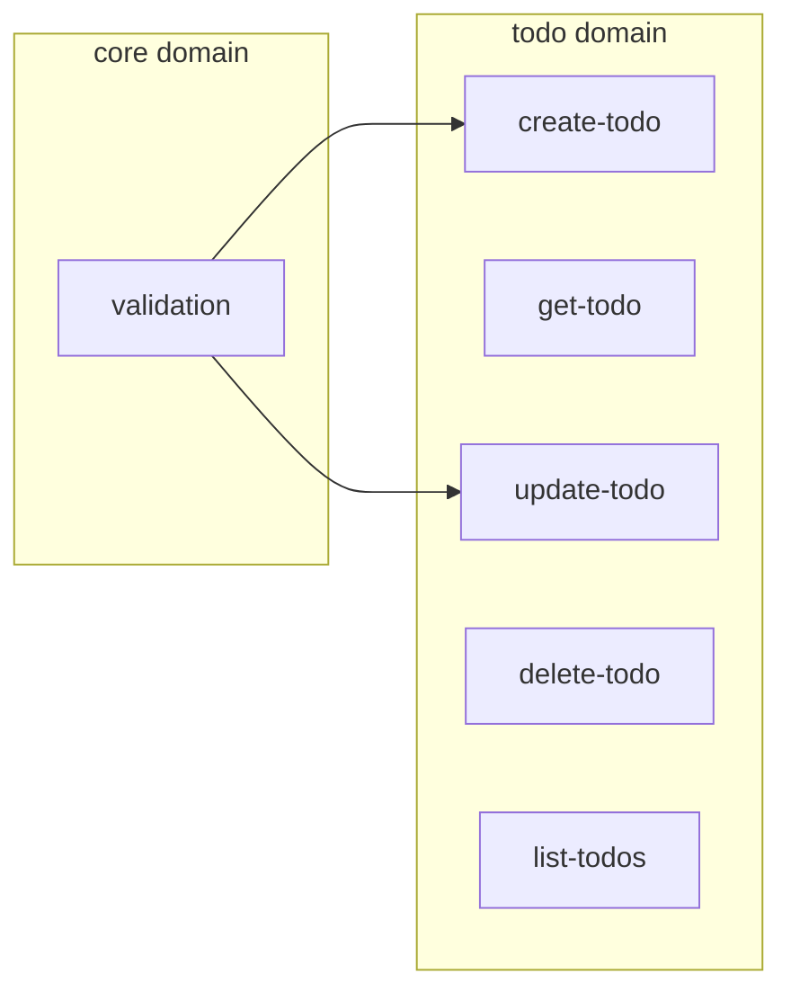

# Getting Started with Greenfield Projects

A tutorial for starting new projects with the SDD methodology.

## Overview

A greenfield project is one that starts from scratch. By applying SDD from the beginning, you can create a high-quality codebase where specifications and implementation stay aligned.

> **Note**: This tutorial is based on an interactive workflow using slash commands in Claude Code.

## Scenario

Let's create a simple todo management API.

## Step 1: Project Initialization

### Create Project

```bash
mkdir todo-api
cd todo-api
npm init -y
```

### SDD Initialization

Run the `sdd init` command in your terminal:

```bash
sdd init
```

```
SDD project has been initialized!

Created items:
  .sdd/specs/
  .sdd/changes/
  .sdd/archive/
  .sdd/templates/
  .claude/commands/    <- Slash commands
  .claude/skills/      <- Development skills
  .sdd/constitution.md
  .sdd/AGENTS.md

Next step: Run /sdd.start in Claude Code.
```

Generated structure:

```
todo-api/
├── .sdd/
│   ├── constitution.md     # Project principles
│   ├── AGENTS.md           # AI guidelines
│   ├── specs/              # Spec repository
│   ├── changes/            # Change proposals
│   ├── archive/            # Archive
│   └── templates/          # Templates
├── .claude/
│   ├── commands/           # Slash commands
│   └── skills/             # Development skills
└── package.json
```

### Start in Claude Code

Now open the project in Claude Code and run `/sdd.start`:

```
/sdd.start
```

```
Project Status

SDD Initialized
Constitution: Template (modification needed)
Specs: 0

Next step: Define project principles with /sdd.constitution.
```

## Step 2: Define Project Constitution

```
/sdd.constitution
```

Claude will interactively establish project principles:

```
Constitution Setup

Project name: todo-api
Version: 1.0.0

Define core principles:

1. Tech Stack:
   -> TypeScript, Express, Prisma

2. Code Principles:
   -> Functions follow single responsibility principle
   -> Errors are handled explicitly
   -> All public APIs require tests

3. Naming Conventions:
   -> Files: kebab-case
   -> Functions: camelCase
   -> Types: PascalCase

Constitution saved: .sdd/constitution.md
```

## Step 3: Domain Design

### Identify Domains

Design the main domains for the todo API:

```
/sdd.domain
```

Design domains through conversation with Claude:

```
User: Design the domains needed for a todo API

Claude: Domain Design

I suggest the following domains for the todo API:

1. core
   Description: Common utilities and types
   Path: src/core/

2. todo
   Description: Todo CRUD operations
   Path: src/todo/
   Dependencies: core

3. user (optional)
   Description: User management
   Path: src/user/
   Dependencies: core

Create these domains? [Y/n]
```

Once approved, domains are created:

```
Domain creation complete

- core: src/core/
- todo: src/todo/ (depends: core)

domains.yml has been updated.
```

## Step 4: Write First Spec

### Create New Spec

```
/sdd.spec Create todo functionality
```

Claude will interactively write the spec:

```
Writing new spec: todo/create-todo

Please provide more details about the functionality:
- What data is needed?
- What validations are required?
- What are the error cases?

User: Title is required (1-200 chars), description is optional, due date is optional.
      Error if title is missing or exceeds 200 chars.

Claude: Spec Draft

## todo/create-todo

Creates a new todo item.

### Scenarios

**Successful creation**
- GIVEN: Valid todo data (title: "Test", description: "Description")
- WHEN: Create request
- THEN: New todo is created and ID is returned

**Missing title**
- GIVEN: Data without title
- WHEN: Create request
- THEN: 400 error (TITLE_REQUIRED)

**Title too long**
- GIVEN: Title with 201+ characters
- WHEN: Create request
- THEN: 400 error (TITLE_TOO_LONG)

### Contract

Input:
  interface CreateTodoInput {
    title: string;        // 1-200 chars, required
    description?: string; // optional
    dueDate?: Date;       // optional
  }

Output:
  interface Todo {
    id: string;
    title: string;
    description?: string;
    dueDate?: Date;
    completed: boolean;
    createdAt: Date;
  }

Save this spec? [Y/n]
```

When saved:

```
Spec saved

File: .sdd/specs/create-todo/spec.md
Status: draft
Domain: todo

Next steps:
- Write additional specs with /sdd.spec
- Create implementation plan with /sdd.plan
```

## Step 5: Add Related Specs

Write the remaining specs:

```
/sdd.spec Input validation utility
```

```
/sdd.spec Get todo
/sdd.spec Update todo
/sdd.spec Delete todo
/sdd.spec List todos
```

For each spec, define scenarios and contracts through conversation with Claude.

## Step 6: Validate Specs

```
/sdd.validate
```

```
Validation complete

Specs: 6
  validation (domain: core)
  create-todo (domain: todo)
  get-todo (domain: todo)
  update-todo (domain: todo)
  delete-todo (domain: todo)
  list-todos (domain: todo)

Warnings: 0
Errors: 0

Dependency graph:
  validation
    └── create-todo
    └── update-todo
```

## Step 7: Implementation Plan

```
/sdd.plan create-todo
```

Claude will write the implementation plan:

```
Implementation Plan: create-todo

## Overview
Implement todo creation using TDD methodology.

## Dependencies
- validation (must be implemented first)

## Implementation Order

1. Type definitions
   - CreateTodoInput interface
   - Todo interface

2. Validation logic
   - validateTitle() function
   - Utilize core/validation

3. Business logic
   - createTodo() function
   - ID generation, timestamp addition

4. API endpoint
   - POST /todos
   - Request/response mapping

## Expected Files
- src/todo/types.ts
- src/todo/create-todo.ts
- src/todo/create-todo.test.ts
- src/todo/routes.ts

Save this plan? [Y/n]
```

## Step 8: Task Breakdown

```
/sdd.tasks create-todo
```

```
Task Breakdown: create-todo

[ ] 1. Type definitions
    - Write CreateTodoInput interface
    - Write Todo interface
    - Estimated time: 10 min

[ ] 2. Write tests (Red)
    - Successful creation test
    - Missing title test
    - Title too long test
    - Estimated time: 20 min

[ ] 3. Implement validation logic (Green)
    - validateTitle function
    - Integrate core/validation
    - Estimated time: 15 min

[ ] 4. Implement business logic (Green)
    - createTodo function
    - Estimated time: 20 min

[ ] 5. Refactoring (Refactor)
    - Code cleanup
    - Estimated time: 10 min

[ ] 6. API endpoint
    - POST /todos route
    - Estimated time: 15 min

Total estimated time: 1 hour 30 minutes
```

## Step 9: Implementation

```
/sdd.implement create-todo
```

Claude will implement using TDD methodology:

```
Starting implementation: create-todo

## Task 1/6: Type definitions

src/todo/types.ts:

  export interface CreateTodoInput {
    title: string;
    description?: string;
    dueDate?: Date;
  }

  export interface Todo {
    id: string;
    title: string;
    description?: string;
    dueDate?: Date;
    completed: boolean;
    createdAt: Date;
  }

Type definitions complete

## Task 2/6: Write tests

src/todo/create-todo.test.ts:

  import { describe, it, expect } from 'vitest';
  import { createTodo } from './create-todo';

  describe('createTodo', () => {
    it('creates a todo with valid data', () => {
      const input = { title: 'Test todo' };
      const result = createTodo(input);

      expect(result.title).toBe('Test todo');
      expect(result.completed).toBe(false);
      expect(result.id).toBeDefined();
    });

    it('throws error when title is missing', () => {
      expect(() => createTodo({ title: '' }))
        .toThrow('TITLE_REQUIRED');
    });

    it('throws error when title exceeds 200 characters', () => {
      const longTitle = 'a'.repeat(201);
      expect(() => createTodo({ title: longTitle }))
        .toThrow('TITLE_TOO_LONG');
    });
  });

Running tests... 3/3 failed (as expected)

## Task 3/6: Implementation...
```

When implementation is complete:

```
Implementation complete: create-todo

Tests: 3/3 passed
Files:
  - src/todo/types.ts
  - src/todo/create-todo.ts
  - src/todo/create-todo.test.ts

Spec status: draft -> implemented

Next tasks:
- Implement other specs with /sdd.implement
- Ask "What should I implement next?" -> Claude will recommend using dev-next skill
```

## Step 10: Iteration

Implement remaining specs the same way:

```
What should I implement next?
```

Claude automatically uses the `dev-next` skill:

```
Next Implementation Recommendation

Based on dependency order:

1. validation (no dependencies)
   - create-todo, update-todo depend on it

2. get-todo (after validation)
   - Simple query, quick to implement

3. list-todos (after get-todo)
   - Includes pagination

Recommendation: Implement validation first.
Say "Implement validation" to proceed.
```

## Check Progress

```
/sdd.status
```

```
Project Status: todo-api

Specs: 6
  Implemented: 2 (33%)
  In Progress: 1 (17%)
  Draft: 3 (50%)

Domains:
  core: 1/1 complete 100%
  todo: 1/5 complete  20%

Tests: 8/8 passed

Next step:
  -> Say "Implement get-todo"
```

## Check Domain Graph

```
/sdd.domain graph
```



## Next Steps

- [Spec Writing Guide](/spec-writing/)
- [Workflow Guide](/guide/workflow)
- [CI/CD Setup](/guide/cicd-setup)

## Summary

1. Initialize project with `sdd init` (CLI)
2. Check project status with `/sdd.start` (Claude Code)
3. Define principles with `/sdd.constitution`
4. Design domains with `/sdd.domain`
5. Write specs with `/sdd.spec`
6. Validate with `/sdd.validate`
7. Plan with `/sdd.plan`, `/sdd.tasks`
8. Implement with TDD using `/sdd.implement`
9. Track progress with `/sdd.status`
