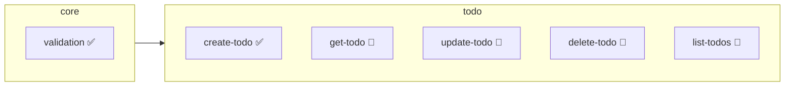

# 그린필드 프로젝트 시작하기

새 프로젝트를 SDD 방식으로 시작하는 튜토리얼입니다.

## 개요

그린필드(Greenfield) 프로젝트는 처음부터 새로 시작하는 프로젝트입니다. SDD를 처음부터 적용하면 명세와 구현이 일치하는 고품질 코드베이스를 만들 수 있습니다.

> **Note**: 이 튜토리얼은 Claude Code에서 슬래시 커맨드를 사용하는 대화형 워크플로우를 기반으로 합니다.

## 시나리오

간단한 할 일 관리 API를 만들어보겠습니다.

## Step 1: 프로젝트 초기화

### 프로젝트 생성

```bash
mkdir todo-api
cd todo-api
npm init -y
```

### SDD 초기화

터미널에서 `sdd init` 명령어를 실행합니다:

```bash
sdd init
```

```
✅ SDD 프로젝트가 초기화되었습니다!

생성된 항목:
  📁 .sdd/specs/
  📁 .sdd/changes/
  📁 .sdd/archive/
  📁 .sdd/templates/
  📁 .claude/commands/    ← 슬래시 커맨드
  📁 .claude/skills/      ← 개발 스킬
  📄 .sdd/constitution.md
  📄 .sdd/AGENTS.md

다음 단계: Claude Code에서 /sdd.start 를 실행하세요.
```

생성되는 구조:

```
todo-api/
├── .sdd/
│   ├── constitution.md     # 프로젝트 원칙
│   ├── AGENTS.md           # AI 지침
│   ├── specs/              # 스펙 저장소
│   ├── changes/            # 변경 제안
│   ├── archive/            # 아카이브
│   └── templates/          # 템플릿
├── .claude/
│   ├── commands/           # 슬래시 커맨드
│   └── skills/             # 개발 스킬
└── package.json
```

### Claude Code에서 시작

이제 Claude Code에서 프로젝트를 열고 `/sdd.start`를 실행합니다:

```
/sdd.start
```

```
📂 프로젝트 상태

✅ SDD 초기화됨
📜 Constitution: 템플릿 (수정 필요)
📋 스펙: 0개

다음 단계: /sdd.constitution 으로 프로젝트 원칙을 정의하세요.
```

## Step 2: 프로젝트 헌법 정의

```
/sdd.constitution
```

Claude가 대화형으로 프로젝트 원칙을 수립합니다:

```
📜 Constitution 설정

프로젝트 이름: todo-api
버전: 1.0.0

핵심 원칙을 정의해주세요:

1. 기술 스택:
   → TypeScript, Express, Prisma

2. 코드 원칙:
   → 함수는 단일 책임 원칙을 따릅니다
   → 에러는 명시적으로 처리합니다
   → 모든 공개 API는 테스트가 필요합니다

3. 네이밍 규칙:
   → 파일명: kebab-case
   → 함수명: camelCase
   → 타입명: PascalCase

Constitution이 저장되었습니다: .sdd/constitution.md
```

## Step 3: 도메인 설계

### 도메인 식별

할 일 API의 주요 도메인을 설계합니다:

```
/sdd.domain
```

Claude와 대화하며 도메인을 설계합니다:

```
User: 할 일 API에 필요한 도메인을 설계해줘

Claude: 📁 도메인 설계

할 일 API에 다음 도메인을 제안합니다:

1. core
   설명: 공통 유틸리티 및 타입
   경로: src/core/

2. todo
   설명: 할 일 CRUD
   경로: src/todo/
   의존성: core

3. user (선택)
   설명: 사용자 관리
   경로: src/user/
   의존성: core

도메인을 생성하시겠습니까? [Y/n]
```

승인하면 도메인이 생성됩니다:

```
✅ 도메인 생성 완료

- core: src/core/
- todo: src/todo/ (depends: core)

domains.yml이 업데이트되었습니다.
```

## Step 4: 첫 번째 스펙 작성

### 새 스펙 생성

```
/sdd.new 할 일 생성 기능
```

Claude가 대화형으로 스펙을 작성합니다:

```
📝 새 스펙 작성: todo/create-todo

기능 설명을 더 자세히 알려주세요:
- 어떤 데이터가 필요한가요?
- 어떤 검증이 필요한가요?
- 에러 케이스는 무엇인가요?

User: 제목(필수, 1-200자), 설명(선택), 마감일(선택)이 필요해.
      제목이 없거나 200자 초과면 에러야.

Claude: 📋 스펙 초안

## todo/create-todo

새로운 할 일 항목을 생성합니다.

### 시나리오

**정상 생성**
- GIVEN: 유효한 할 일 데이터 (제목: "테스트", 설명: "설명")
- WHEN: 생성 요청
- THEN: 새 할 일이 생성되고 ID가 반환됨

**제목 누락**
- GIVEN: 제목이 없는 데이터
- WHEN: 생성 요청
- THEN: 400 에러 (TITLE_REQUIRED)

**제목 길이 초과**
- GIVEN: 201자 이상 제목
- WHEN: 생성 요청
- THEN: 400 에러 (TITLE_TOO_LONG)

### 계약

입력:
```typescript
interface CreateTodoInput {
  title: string;        // 1-200자, 필수
  description?: string; // 선택
  dueDate?: Date;       // 선택
}
```

출력:
```typescript
interface Todo {
  id: string;
  title: string;
  description?: string;
  dueDate?: Date;
  completed: boolean;
  createdAt: Date;
}
```

스펙을 저장하시겠습니까? [Y/n]
```

저장하면:

```
✅ 스펙 저장 완료

파일: .sdd/specs/todo/create-todo.md
상태: draft

다음 단계:
- /sdd.new 으로 추가 스펙 작성
- /sdd.plan 으로 구현 계획 작성
```

## Step 5: 관련 스펙 추가

나머지 스펙도 작성합니다:

```
/sdd.new 입력 검증 유틸리티
```

```
/sdd.new 할 일 조회
/sdd.new 할 일 수정
/sdd.new 할 일 삭제
/sdd.new 할 일 목록
```

각 스펙에 대해 Claude와 대화하며 시나리오와 계약을 정의합니다.

## Step 6: 스펙 검증

```
/sdd.validate
```

```
✅ 검증 완료

스펙: 6개
  ✅ core/validation
  ✅ todo/create-todo
  ✅ todo/get-todo
  ✅ todo/update-todo
  ✅ todo/delete-todo
  ✅ todo/list-todos

경고: 0개
오류: 0개

의존성 그래프:
  core/validation
    └── todo/create-todo
    └── todo/update-todo
```

## Step 7: 구현 계획

```
/sdd.plan todo/create-todo
```

Claude가 구현 계획을 작성합니다:

```
📐 구현 계획: todo/create-todo

## 개요
할 일 생성 기능을 TDD 방식으로 구현합니다.

## 의존성
- core/validation (먼저 구현 필요)

## 구현 순서

1. 타입 정의
   - CreateTodoInput 인터페이스
   - Todo 인터페이스

2. 검증 로직
   - validateTitle() 함수
   - core/validation 활용

3. 비즈니스 로직
   - createTodo() 함수
   - ID 생성, 타임스탬프 추가

4. API 엔드포인트
   - POST /todos
   - 요청/응답 매핑

## 예상 파일
- src/todo/types.ts
- src/todo/create-todo.ts
- src/todo/create-todo.test.ts
- src/todo/routes.ts

계획을 저장하시겠습니까? [Y/n]
```

## Step 8: 작업 분해

```
/sdd.tasks todo/create-todo
```

```
📋 작업 분해: todo/create-todo

[ ] 1. 타입 정의
    - CreateTodoInput 인터페이스 작성
    - Todo 인터페이스 작성
    - 예상 시간: 10분

[ ] 2. 테스트 작성 (Red)
    - 정상 생성 테스트
    - 제목 누락 테스트
    - 제목 길이 초과 테스트
    - 예상 시간: 20분

[ ] 3. 검증 로직 구현 (Green)
    - validateTitle 함수
    - core/validation 연동
    - 예상 시간: 15분

[ ] 4. 비즈니스 로직 구현 (Green)
    - createTodo 함수
    - 예상 시간: 20분

[ ] 5. 리팩토링 (Refactor)
    - 코드 정리
    - 예상 시간: 10분

[ ] 6. API 엔드포인트
    - POST /todos 라우트
    - 예상 시간: 15분

총 예상 시간: 1시간 30분
```

## Step 9: 구현

```
/sdd.implement todo/create-todo
```

Claude가 TDD 방식으로 구현을 진행합니다:

```
🔨 구현 시작: todo/create-todo

## 작업 1/6: 타입 정의

src/todo/types.ts:
```typescript
export interface CreateTodoInput {
  title: string;
  description?: string;
  dueDate?: Date;
}

export interface Todo {
  id: string;
  title: string;
  description?: string;
  dueDate?: Date;
  completed: boolean;
  createdAt: Date;
}
```

✅ 타입 정의 완료

## 작업 2/6: 테스트 작성

src/todo/create-todo.test.ts:
```typescript
import { describe, it, expect } from 'vitest';
import { createTodo } from './create-todo';

describe('createTodo', () => {
  it('유효한 데이터로 할 일을 생성한다', () => {
    const input = { title: '테스트 할 일' };
    const result = createTodo(input);

    expect(result.title).toBe('테스트 할 일');
    expect(result.completed).toBe(false);
    expect(result.id).toBeDefined();
  });

  it('제목이 없으면 에러를 반환한다', () => {
    expect(() => createTodo({ title: '' }))
      .toThrow('TITLE_REQUIRED');
  });

  it('제목이 200자를 초과하면 에러를 반환한다', () => {
    const longTitle = 'a'.repeat(201);
    expect(() => createTodo({ title: longTitle }))
      .toThrow('TITLE_TOO_LONG');
  });
});
```

테스트 실행 중... ❌ 3/3 실패 (예상대로)

## 작업 3/6: 구현...
```

구현이 완료되면:

```
✅ 구현 완료: todo/create-todo

테스트: ✅ 3/3 통과
파일:
  - src/todo/types.ts
  - src/todo/create-todo.ts
  - src/todo/create-todo.test.ts

스펙 상태: draft → implemented

다음 작업:
- /sdd.implement 으로 다른 스펙 구현
- "다음 뭐 구현할까?" → Claude가 dev-next 스킬로 추천
```

## Step 10: 반복

남은 스펙도 같은 방식으로 구현합니다:

```
다음 뭐 구현해야 해?
```

Claude가 자동으로 `dev-next` 스킬을 사용합니다:

```
📊 다음 구현 추천

의존성 순서 기준:

1. core/validation ⭐ (의존성 없음)
   - todo/create-todo, todo/update-todo가 의존

2. todo/get-todo (core 완료 후)
   - 단순 조회, 빠른 구현 가능

3. todo/list-todos (get-todo 완료 후)
   - 페이지네이션 포함

추천: core/validation 먼저 구현하세요.
/sdd.implement core/validation
```

## 진행 상황 확인

```
/sdd.status
```

```
📊 프로젝트 현황: todo-api

스펙: 6개
  ✅ 구현됨: 2개 (33%)
  🔄 진행중: 1개 (17%)
  📝 초안: 3개 (50%)

도메인:
  core: 1/1 완료 ████████████ 100%
  todo: 1/5 완료 ██░░░░░░░░░░ 20%

테스트: 8/8 통과

다음 단계:
  → /sdd.implement todo/get-todo
```

## 도메인 그래프 확인

```
/sdd.domain graph
```



## 다음 단계

- [스펙 작성 가이드](/spec-writing/)
- [워크플로우 가이드](/guide/workflow)
- [CI/CD 설정](/guide/cicd-setup)

## 요약

1. `sdd init`으로 프로젝트 초기화 (CLI)
2. `/sdd.start`로 프로젝트 상태 확인 (Claude Code)
3. `/sdd.constitution`으로 원칙 정의
4. `/sdd.domain`으로 도메인 설계
5. `/sdd.new`로 스펙 작성
6. `/sdd.validate`로 검증
7. `/sdd.plan`, `/sdd.tasks`로 계획
8. `/sdd.implement`로 TDD 구현
9. `/sdd.status`로 진행 추적
