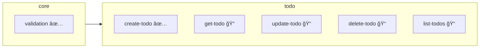

# 그린필드 프로ì íŠ¸ ì‹œì‘하기

새 프로ì íŠ¸ë¥¼ SDD ë°©ì‹ìœ¼ë¡œ ì‹œì‘하는 튜토리얼ì…니다.

## 개요

그린필드(Greenfield) 프로ì íŠ¸ëŠ” 처ìŒë¶€í„° 새로 ì‹œì‘하는 프로ì íŠ¸ì…니다. SDD를 처ìŒë¶€í„° ì ìš©í•˜ë©´ 명세와 êµ¬í˜„ì´ ì¼ì¹˜í•˜ëŠ” 고품질 코드베ì´ìŠ¤ë¥¼ 만들 수 ìˆìŠµë‹ˆë‹¤.

> **Note**: ì´ íŠœí† ë¦¬ì–¼ì€ Claude Codeì—ì„œ 슬ë˜ì‹œ 커맨드를 사용하는 대화형 워í¬í”Œë¡œìš°ë¥¼ 기반으로 합니다.

## 시나리오

간단한 í•  ì¼ ê´€ë¦¬ API를 만들어보겠습니다.

## Step 1: 프로ì íŠ¸ 초기화

### 프로ì íŠ¸ ìƒì„±

```bash
mkdir todo-api
cd todo-api
npm init -y
```

### SDD 초기화

터미ë„ì—ì„œ `sdd init` 명령어를 실행합니다:

```bash
sdd init
```

```
✅ SDD 프로ì íŠ¸ê°€ 초기화ë˜ì—ˆìŠµë‹ˆë‹¤!

ìƒì„±ëœ 항목:
  📠.sdd/specs/
  📠.sdd/changes/
  📠.sdd/archive/
  📠.sdd/templates/
  📠.claude/commands/    ↠슬ë˜ì‹œ 커맨드
  📠.claude/skills/      ↠개발 스킬
  📄 .sdd/constitution.md
  📄 .sdd/AGENTS.md

ë‹¤ìŒ ë‹¨ê³„: Claude Codeì—ì„œ /sdd.start 를 실행하세요.
```

ìƒì„±ë˜ëŠ” 구조:

```
todo-api/
├── .sdd/
│   ├── constitution.md     # 프로ì íŠ¸ ì›ì¹™
│   ├── AGENTS.md           # AI 지침
│   ├── specs/              # ìŠ¤í™ ì €ì¥ì†Œ
│   ├── changes/            # 변경 제안
│   ├── archive/            # ì•„ì¹´ì´ë¸Œ
│   └── templates/          # 템플릿
├── .claude/
│   ├── commands/           # 슬ë˜ì‹œ 커맨드
│   └── skills/             # 개발 스킬
└── package.json
```

### Claude Codeì—ì„œ ì‹œì‘

ì´ì œ Claude Codeì—ì„œ 프로ì íŠ¸ë¥¼ ì—´ê³  `/sdd.start`를 실행합니다:

```
/sdd.start
```

```
📂 프로ì íŠ¸ ìƒíƒœ

✅ SDD 초기화ë¨
📜 Constitution: 템플릿 (수정 필요)
📋 스í™: 0ê°œ

ë‹¤ìŒ ë‹¨ê³„: /sdd.constitution 으로 프로ì íŠ¸ ì›ì¹™ì„ ì •ì˜í•˜ì„¸ìš”.
```

## Step 2: 프로ì íŠ¸ 헌법 ì •ì˜

```
/sdd.constitution
```

Claudeê°€ 대화형으로 프로ì íŠ¸ ì›ì¹™ì„ 수립합니다:

```
📜 Constitution 설정

프로ì íŠ¸ ì´ë¦„: todo-api
버전: 1.0.0

핵심 ì›ì¹™ì„ ì •ì˜í•´ì£¼ì„¸ìš”:

1. 기술 스íƒ:
   → TypeScript, Express, Prisma

2. 코드 ì›ì¹™:
   → 함수는 ë‹¨ì¼ ì±…ì„ ì›ì¹™ì„ 따릅니다
   → ì—러는 명시ì ìœ¼ë¡œ 처리합니다
   → 모든 공개 API는 테스트가 필요합니다

3. 네ì´ë° 규칙:
   → 파ì¼ëª…: kebab-case
   → 함수명: camelCase
   → 타ì…명: PascalCase

Constitutionì´ ì €ì¥ë˜ì—ˆìŠµë‹ˆë‹¤: .sdd/constitution.md
```

## Step 3: ë„ë©”ì¸ ì„¤ê³„

### ë„ë©”ì¸ ì‹ë³„

í•  ì¼ APIì˜ ì£¼ìš” ë„ë©”ì¸ì„ 설계합니다:

```
/sdd.domain
```

Claude와 대화하며 ë„ë©”ì¸ì„ 설계합니다:

```
User: í•  ì¼ APIì— í•„ìš”í•œ ë„ë©”ì¸ì„ 설계해줘

Claude: 📠ë„ë©”ì¸ ì„¤ê³„

í•  ì¼ APIì— ë‹¤ìŒ ë„ë©”ì¸ì„ 제안합니다:

1. core
   설명: 공통 유틸리티 ë° íƒ€ì…
   경로: src/core/

2. todo
   설명: í•  ì¼ CRUD
   경로: src/todo/
   ì˜ì¡´ì„±: core

3. user (ì„ íƒ)
   설명: 사용ì 관리
   경로: src/user/
   ì˜ì¡´ì„±: core

ë„ë©”ì¸ì„ ìƒì„±í•˜ì‹œê² ìŠµë‹ˆê¹Œ? [Y/n]
```

승ì¸í•˜ë©´ ë„ë©”ì¸ì´ ìƒì„±ë©ë‹ˆë‹¤:

```
✅ ë„ë©”ì¸ ìƒì„± 완료

- core: src/core/
- todo: src/todo/ (depends: core)

domains.ymlì´ ì—…ë°ì´íŠ¸ë˜ì—ˆìŠµë‹ˆë‹¤.
```

## Step 4: 첫 번째 ìŠ¤í™ ì‘성

### 새 ìŠ¤í™ ìƒì„±

```
/sdd.new í•  ì¼ ìƒì„± 기능
```

Claudeê°€ 대화형으로 스í™ì„ ì‘성합니다:

```
📠새 ìŠ¤í™ ì‘성: todo/create-todo

기능 ì„¤ëª…ì„ ë” ìì„¸íˆ ì•Œë ¤ì£¼ì„¸ìš”:
- ì–´ë–¤ ë°ì´í„°ê°€ 필요한가요?
- ì–´ë–¤ ê²€ì¦ì´ 필요한가요?
- ì—러 ì¼€ì´ìŠ¤ëŠ” 무엇ì¸ê°€ìš”?

User: 제목(필수, 1-200ì), 설명(ì„ íƒ), 마ê°ì¼(ì„ íƒ)ì´ í•„ìš”í•´.
      ì œëª©ì´ ì—†ê±°ë‚˜ 200ì 초과면 ì—러야.

Claude: 📋 ìŠ¤í™ ì´ˆì•ˆ

## todo/create-todo

새로운 í•  ì¼ í•­ëª©ì„ ìƒì„±í•©ë‹ˆë‹¤.

### 시나리오

**ì •ìƒ ìƒì„±**
- GIVEN: 유효한 í•  ì¼ ë°ì´í„° (제목: "테스트", 설명: "설명")
- WHEN: ìƒì„± 요청
- THEN: 새 í•  ì¼ì´ ìƒì„±ë˜ê³  IDê°€ 반환ë¨

**제목 누ë½**
- GIVEN: ì œëª©ì´ ì—†ëŠ” ë°ì´í„°
- WHEN: ìƒì„± 요청
- THEN: 400 ì—러 (TITLE_REQUIRED)

**제목 ê¸¸ì´ ì´ˆê³¼**
- GIVEN: 201ì ì´ìƒ 제목
- WHEN: ìƒì„± 요청
- THEN: 400 ì—러 (TITLE_TOO_LONG)

### 계약

ì…ë ¥:
```typescript
interface CreateTodoInput {
  title: string;        // 1-200ì, 필수
  description?: string; // ì„ íƒ
  dueDate?: Date;       // ì„ íƒ
}
```

출력:
```typescript
interface Todo {
  id: string;
  title: string;
  description?: string;
  dueDate?: Date;
  completed: boolean;
  createdAt: Date;
}
```

스í™ì„ ì €ì¥í•˜ì‹œê² ìŠµë‹ˆê¹Œ? [Y/n]
```

ì €ì¥í•˜ë©´:

```
✅ ìŠ¤í™ ì €ì¥ ì™„ë£Œ

파ì¼: .sdd/specs/todo/create-todo.md
ìƒíƒœ: draft

ë‹¤ìŒ ë‹¨ê³„:
- /sdd.new 으로 추가 ìŠ¤í™ ì‘성
- /sdd.plan 으로 구현 ê³„íš ì‘성
```

## Step 5: 관련 ìŠ¤í™ ì¶”ê°€

나머지 스í™ë„ ì‘성합니다:

```
/sdd.new ì…ë ¥ ê²€ì¦ ìœ í‹¸ë¦¬í‹°
```

```
/sdd.new í•  ì¼ ì¡°íšŒ
/sdd.new í•  ì¼ ìˆ˜ì •
/sdd.new í•  ì¼ ì‚­ì œ
/sdd.new í•  ì¼ ëª©ë¡
```

ê° ìŠ¤í™ì— 대해 Claude와 대화하며 시나리오와 ê³„ì•½ì„ ì •ì˜í•©ë‹ˆë‹¤.

## Step 6: ìŠ¤í™ ê²€ì¦

```
/sdd.validate
```

```
✅ ê²€ì¦ ì™„ë£Œ

스í™: 6ê°œ
  ✅ core/validation
  ✅ todo/create-todo
  ✅ todo/get-todo
  ✅ todo/update-todo
  ✅ todo/delete-todo
  ✅ todo/list-todos

경고: 0개
오류: 0개

ì˜ì¡´ì„± ê·¸ë˜í”„:
  core/validation
    └── todo/create-todo
    └── todo/update-todo
```

## Step 7: 구현 계íš

```
/sdd.plan todo/create-todo
```

Claudeê°€ 구현 계íšì„ ì‘성합니다:

```
📠구현 계íš: todo/create-todo

## 개요
í•  ì¼ ìƒì„± ê¸°ëŠ¥ì„ TDD ë°©ì‹ìœ¼ë¡œ 구현합니다.

## ì˜ì¡´ì„±
- core/validation (먼저 구현 필요)

## 구현 순서

1. íƒ€ì… ì •ì˜
   - CreateTodoInput ì¸í„°í˜ì´ìŠ¤
   - Todo ì¸í„°í˜ì´ìŠ¤

2. ê²€ì¦ ë¡œì§
   - validateTitle() 함수
   - core/validation 활용

3. 비즈니스 ë¡œì§
   - createTodo() 함수
   - ID ìƒì„±, 타ì„스탬프 추가

4. API 엔드í¬ì¸íŠ¸
   - POST /todos
   - 요청/ì‘답 매핑

## ì˜ˆìƒ íŒŒì¼
- src/todo/types.ts
- src/todo/create-todo.ts
- src/todo/create-todo.test.ts
- src/todo/routes.ts

계íšì„ ì €ì¥í•˜ì‹œê² ìŠµë‹ˆê¹Œ? [Y/n]
```

## Step 8: ì‘ì—… 분해

```
/sdd.tasks todo/create-todo
```

```
📋 ì‘ì—… 분해: todo/create-todo

[ ] 1. íƒ€ì… ì •ì˜
    - CreateTodoInput ì¸í„°í˜ì´ìŠ¤ ì‘성
    - Todo ì¸í„°í˜ì´ìŠ¤ ì‘성
    - ì˜ˆìƒ ì‹œê°„: 10분

[ ] 2. 테스트 ì‘성 (Red)
    - ì •ìƒ ìƒì„± 테스트
    - 제목 ëˆ„ë½ í…ŒìŠ¤íŠ¸
    - 제목 ê¸¸ì´ ì´ˆê³¼ 테스트
    - ì˜ˆìƒ ì‹œê°„: 20분

[ ] 3. ê²€ì¦ ë¡œì§ êµ¬í˜„ (Green)
    - validateTitle 함수
    - core/validation ì—°ë™
    - ì˜ˆìƒ ì‹œê°„: 15분

[ ] 4. 비즈니스 ë¡œì§ êµ¬í˜„ (Green)
    - createTodo 함수
    - ì˜ˆìƒ ì‹œê°„: 20분

[ ] 5. ë¦¬íŒ©í† ë§ (Refactor)
    - 코드 정리
    - ì˜ˆìƒ ì‹œê°„: 10분

[ ] 6. API 엔드í¬ì¸íŠ¸
    - POST /todos ë¼ìš°íŠ¸
    - ì˜ˆìƒ ì‹œê°„: 15분

ì´ ì˜ˆìƒ ì‹œê°„: 1시간 30분
```

## Step 9: 구현

```
/sdd.implement todo/create-todo
```

Claudeê°€ TDD ë°©ì‹ìœ¼ë¡œ êµ¬í˜„ì„ ì§„í–‰í•©ë‹ˆë‹¤:

```
🔨 구현 ì‹œì‘: todo/create-todo

## ì‘ì—… 1/6: íƒ€ì… ì •ì˜

src/todo/types.ts:
```typescript
export interface CreateTodoInput {
  title: string;
  description?: string;
  dueDate?: Date;
}

export interface Todo {
  id: string;
  title: string;
  description?: string;
  dueDate?: Date;
  completed: boolean;
  createdAt: Date;
}
```

✅ íƒ€ì… ì •ì˜ ì™„ë£Œ

## ì‘ì—… 2/6: 테스트 ì‘성

src/todo/create-todo.test.ts:
```typescript
import { describe, it, expect } from 'vitest';
import { createTodo } from './create-todo';

describe('createTodo', () => {
  it('유효한 ë°ì´í„°ë¡œ í•  ì¼ì„ ìƒì„±í•œë‹¤', () => {
    const input = { title: '테스트 í•  ì¼' };
    const result = createTodo(input);

    expect(result.title).toBe('테스트 í•  ì¼');
    expect(result.completed).toBe(false);
    expect(result.id).toBeDefined();
  });

  it('ì œëª©ì´ ì—†ìœ¼ë©´ ì—러를 반환한다', () => {
    expect(() => createTodo({ title: '' }))
      .toThrow('TITLE_REQUIRED');
  });

  it('ì œëª©ì´ 200ì를 초과하면 ì—러를 반환한다', () => {
    const longTitle = 'a'.repeat(201);
    expect(() => createTodo({ title: longTitle }))
      .toThrow('TITLE_TOO_LONG');
  });
});
```

테스트 실행 중... ⌠3/3 실패 (예ìƒëŒ€ë¡œ)

## ì‘ì—… 3/6: 구현...
```

êµ¬í˜„ì´ ì™„ë£Œë˜ë©´:

```
✅ 구현 완료: todo/create-todo

테스트: ✅ 3/3 통과
파ì¼:
  - src/todo/types.ts
  - src/todo/create-todo.ts
  - src/todo/create-todo.test.ts

ìŠ¤í™ ìƒíƒœ: draft → implemented

ë‹¤ìŒ ì‘ì—…:
- /sdd.implement 으로 다른 ìŠ¤í™ êµ¬í˜„
- "ë‹¤ìŒ ë­ êµ¬í˜„í• ê¹Œ?" → Claudeê°€ dev-next 스킬로 추천
```

## Step 10: 반복

ë‚¨ì€ ìŠ¤í™ë„ ê°™ì€ ë°©ì‹ìœ¼ë¡œ 구현합니다:

```
ë‹¤ìŒ ë­ êµ¬í˜„í•´ì•¼ í•´?
```

Claudeê°€ ìë™ìœ¼ë¡œ `dev-next` ìŠ¤í‚¬ì„ ì‚¬ìš©í•©ë‹ˆë‹¤:

```
📊 ë‹¤ìŒ êµ¬í˜„ 추천

ì˜ì¡´ì„± 순서 기준:

1. core/validation â­ (ì˜ì¡´ì„± ì—†ìŒ)
   - todo/create-todo, todo/update-todoê°€ ì˜ì¡´

2. todo/get-todo (core 완료 후)
   - 단순 조회, 빠른 구현 가능

3. todo/list-todos (get-todo 완료 후)
   - í˜ì´ì§€ë„¤ì´ì…˜ í¬í•¨

추천: core/validation 먼저 구현하세요.
/sdd.implement core/validation
```

## 진행 ìƒí™© 확ì¸

```
/sdd.status
```

```
📊 프로ì íŠ¸ 현황: todo-api

스í™: 6ê°œ
  ✅ 구현ë¨: 2ê°œ (33%)
  🔄 진행중: 1개 (17%)
  📠초안: 3개 (50%)

ë„ë©”ì¸:
  core: 1/1 완료 ████████████ 100%
  todo: 1/5 완료 ██░░░░░░░░░░ 20%

테스트: 8/8 통과

ë‹¤ìŒ ë‹¨ê³„:
  → /sdd.implement todo/get-todo
```

## ë„ë©”ì¸ ê·¸ë˜í”„ 확ì¸

```
/sdd.domain graph
```



## ë‹¤ìŒ ë‹¨ê³„

- [ìŠ¤í™ ì‘성 ê°€ì´ë“œ](/spec-writing/)
- [워í¬í”Œë¡œìš° ê°€ì´ë“œ](/guide/workflow)
- [CI/CD 설정](/guide/cicd-setup)

## 요약

1. `sdd init`으로 프로ì íŠ¸ 초기화 (CLI)
2. `/sdd.start`ë¡œ 프로ì íŠ¸ ìƒíƒœ í™•ì¸ (Claude Code)
3. `/sdd.constitution`으로 ì›ì¹™ ì •ì˜
4. `/sdd.domain`으로 ë„ë©”ì¸ ì„¤ê³„
5. `/sdd.new`ë¡œ ìŠ¤í™ ì‘성
6. `/sdd.validate`ë¡œ ê²€ì¦
7. `/sdd.plan`, `/sdd.tasks`ë¡œ 계íš
8. `/sdd.implement`로 TDD 구현
9. `/sdd.status`ë¡œ 진행 추ì 
